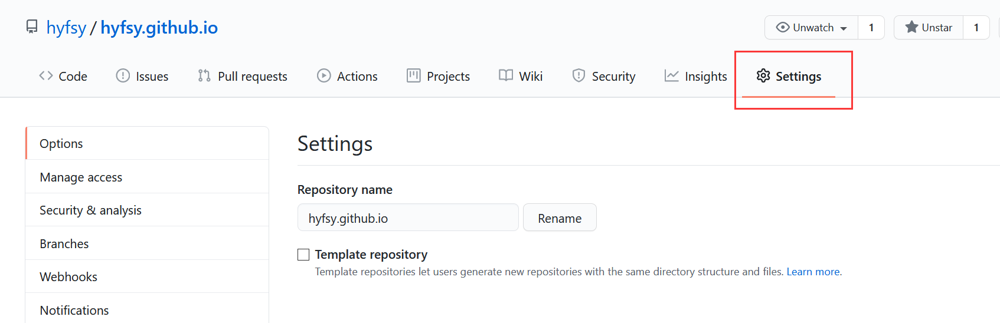
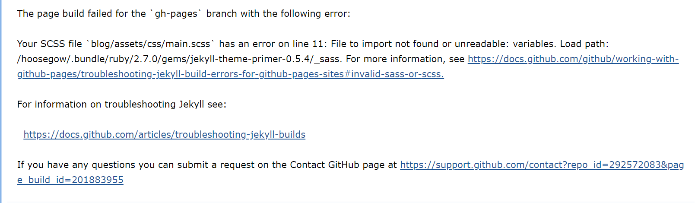
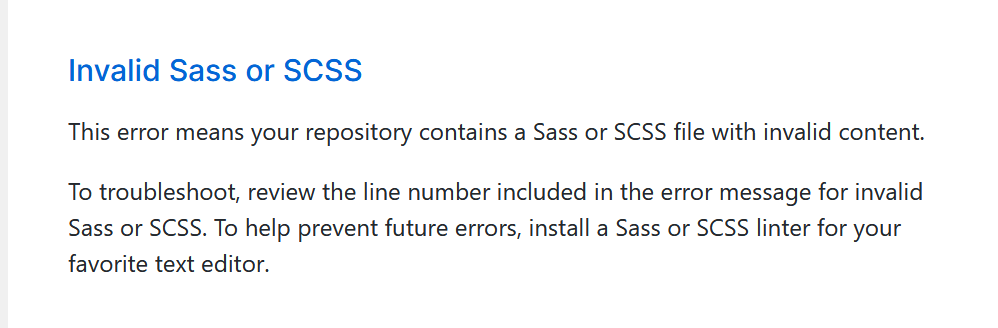

# GitHub Pages 介绍及搭建

---

GitHub Pages，一般多用于托管个人的静态网站，所以现在很多人也用来它来搭建私人博客，也算是省去了购买服务器、域名等等一系列复杂的操作。搭建博客网站有各种各样的方法，如果想简单和简约，那么强烈推荐使用Github Pages。在学习以下内容之前，需要了解GitHub相关内容，一些基本要求我就不在这里说明了。

此处以搭建博客为例子

创建自己域名的仓库：`[username].github.io`

找到合适的jekyll模板资源，参考【静态站点生成器 - jekyll】

GitHub内部本身支持jekyll，所以此处采用该静态站点生成器

目录结构：

- _data，特殊的配置

- _includes，组件页面的存放位置，如head、meta等等

- _layouts，总体的布局页面的存放位置

- _posts，文章默认的存放位置

- _sass，sass文件的存放位置

- _site，编译转化的结果存放位置

- _config.yml，jekyl模板引擎的总配置文件

- Gemfile，jekyll指定依赖的文件

上传到自己域名下的GitHub项目中，GitHub会自动编译我们的静态网站

> 按照这个目录结构放到仓库的master分支，肯定不会出问题

# GitHub中的配置

---

> 一个用户只能有一个GitHub Pages

进入Settings

下拉到 GitHub Pages 模块

**第一行：**可以看到我们的博客的访问地址

**Source：**是指定我们的项目的存放的分支和文件夹（固定两个）

**Theme Chooser：**可以选择一个为我们提供的主题

**Custom domain：**可以给我们原本的地址分配一个自己的域名，分配成功后，上面的访问地址会改变

**Enforce HTTPS：**现在都强制使用http了

# 部署问题

---

一开始是按照上面那样部署成功的，由于刚弄，很多东西都不太完善，然后想搞个文件夹专门放博客项目的，然后噩梦就来了

一开始没注意这邮件，发我邮箱的，然后我更新了一些东西到我项目上，就开始频繁的发邮件给我了，我看的是一脸闷逼，啥也不懂怎么jekyll就构建失败了，然后我就按照邮件上面的提示信息去找，检查我本地的scss文件，路径报错，改了还是没用，找了一会发现_config.yml内已经配置了scss路径，所以直接引用就可以了，报错也没事，又还原，想想之前是编译成功的，应该不是文件的问题

然后我就听网上说的把项目放到gh-pages分支上面了，放好了，然后......呵呵，还是一样构建失败

然后就是各种百度，啥用没有，浪费时间，emmm......啥也没用，心态崩了

然后我就突然想起之前是放在master分支上的，是可以的，就慢慢的还原，我又换回到项目统一放到一个文件夹内的方式，还是没用，已经是出问题的第二天了，最后我只好放弃这么好的结构，将整个博客项目还原出来了，就是上面的结构，总算好了。。。

总结一句，GitHub误导人是一流的，邮件的信息根本不可信。项目都只能放在外部才有用 我也不知道为什么，可能项目不管放哪GitHub默认都只会读取master分支上的配置并编译吧。两天血的教训~~

展示下噩梦邮件，每次上传项目进行构建都心惊胆战的

不过还好总算告一段落了

好吧，上班时间有点划水了，心慌慌