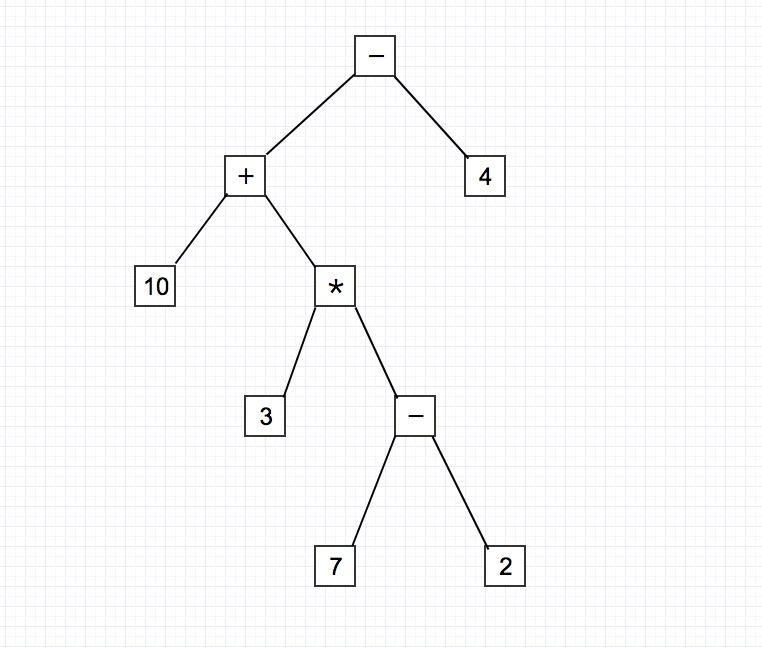
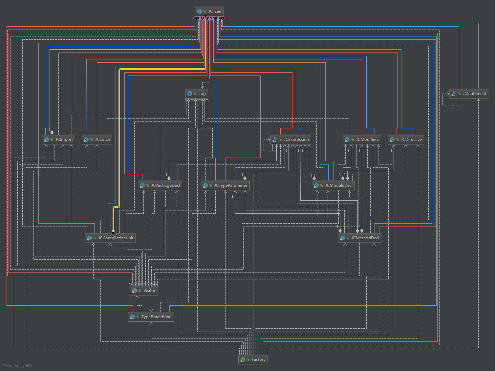

今天来聊聊我们的lombok，当然，不是讲如何使用的了，咱们讲讲它的**实现原理**


## 1. lombok


先简单讲下什么是lombok，以防部分小白不懂

一般的实体类都是这样定义的

```java
public class User {

    private int          age;
    private String       name;

    public int getAge() { return age; }

    public void setAge(int age) { this.age = age; }

    public String getName() { return name; }

    public void setName(String name) { this.name = name; }
}
```


定义了很多成员变量，以及getter/setter方法

数据库的字段少还好，一旦多起来后，类中就会充斥着大量的getter/setter方法，而lombok就可以在java文件编译的时候通过**指定的注解**自动生成这些getter/setter方法


简化后：

```java
@Getter
@Setter
public class User {
    private int          age;
    private String       name;
}
```

整个类看着是不是清晰了很多，程序运行时还是**可以调用方法**的

> 配合lombok插件可取消报红，并增加IDE提示


## 2. 注解处理器


熟悉lombok的都应该知道lombok是在**javac编译时**通过annotation processor（JSR 269）来生成这些方法的。


我自己第一次了解到注解处理器是在springboot中，有两处地方使用到：

1. `ConfigurationMetadataAnnotationProcessor`用来生成`@ConfigurationProperties`注解注释的相关的元数据信息，生成文件，方便IDE提示

2. `AutoConfigureAnnotationProcessor`生成自动配置注解的信息及过滤条件，存入配置文件，这样可以快速过滤不匹配的自动配置，缩短应用启动时间


注解处理器会在**程序编译时**，自动执行process方法中的逻辑，方法会传入两个参数：一个是类上方指定的注解元素列表，另一个是环境对象（包含所有需要编译的java类元素）

```java
@SupportedAnnotationTypes({ "需要处理的注解全类名" })
public class MyProcessor extends AbstractProcessor {

    @Override
    public synchronized void init(ProcessingEnvironment processingEnv) {
        super.init(processingEnv); // 包含很多处理工具
    }

    @Override
    public boolean process(Set<? extends TypeElement> annotations, RoundEnvironment roundEnv) {
    	// ...
    }
}
```


## 3. 抽象语法树（AST）

进行下一步之前，先简单了解一下AST：

抽象语法树（abstract syntax code，AST）是源代码的抽象语法结构的树状表示，树上的每个节点都表示源代码中的一种结构，主要便于计算机理解和阅读。

一般只有语言的编译器开发人员或者从事语言设计的人员才涉及到语法树的提取和处理，所以很多人会对这个概念比较陌生。

下面放张图看看：


```
10 + 3 * (7 - 2) - 4
```




java中的AST：


众所周知，Java 编译流程（下图）中对AST语法树的提取处理


 

通过流程可知，在注解处理器处理期间，我们可以获取到所有的抽象语法树，并可以对抽象语法树进行大家最爱的增删改查（滑稽）


Lombok也是这么操作的，修改了抽象语法树，添加了对应的节点，最后在class文件中生成相关代码，只不过它的逻辑肯定更复杂。

javassist虽然也能修改class文件，但区别在于后者只能在程序运行时操作，如果要使用不存在的方法，那编译都不会通过，更别说运行了


> 前端的babel之所以能将ES6的语法编译为ES5等等操作，内部应该也是构建了一个自己的抽象语法树


## 4. JCTree

java中的AST实际上就是一个`JCTree`对象，通过此对象，我们可以很方便的对语法树进行操作，包括在类中添加变量、方法、类等等。

该类及其他相关类都在tools.jar中，jdk自带

图不全，实际该类中有很多内部类，继承`JCTree`，表示为一个个不同的语法节点，详细可以参考[这篇博客](https://blog.csdn.net/u013998373/article/details/90050810)




JCTree包含三样东西

```java
public int pos; // 指明当前语法节点在语法树中的位置
public Type type; // 表示语法结构的类型，可以理解为实际上的java类型（仅部分节点有，如变量节点）
public abstract JCTree.Tag getTag(); // 获取当前的节点类型，如if节点、while节点等等
```


## 5. 实操


**代码获取`JCTree`**

```java
@SupportedAnnotationTypes("com.hyf.processor.core.GetterSetter")
public class MyProcessor extends AbstractProcessor {

	private JavacTrees javacTrees; // AST工具，专门用来获取抽象语法树

    @Override
    public synchronized void init(ProcessingEnvironment processingEnv) {

        super.init(processingEnv);

        // 额外初始化一些资源操作对象

        this.javacTrees = JavacTrees.instance(processingEnv);
    }

    @Override
    public boolean process(Set<? extends TypeElement> annotations, RoundEnvironment roundEnv) {

        // 类上指定的所有注解，当然现在只有一个
        for (TypeElement annotation : annotations) {
            // 获取注解注释的所有元素，注解为ElementType.TYPE，所以此处为类元素
            Set<? extends Element> elements = roundEnv.getElementsAnnotatedWith(annotation);
            for (Element element : elements) {
                // 获取类元素对象的抽象语法树
                JCTree jcTree = javacTrees.getTree(element);

                // ......
            }
        }

        return false; // 只要知道此处为false即可
    }
}
```


**对`JCTree`进行处理**

```java
// 标准的访问者模式
jcTree.accept(new TreeTranslator() {
    /**
     * 遍历每个变量节点，循环调用此方法
     */
    @Override
    public void visitVarDef(JCTree.JCVariableDecl jcVariableDecl) {
        super.visitVarDef(jcVariableDecl);
        // 可在此存储好类中的变量节点信息
    }

    @Override
    public void visitMethodDef(JCTree.JCMethodDecl jcMethodDecl) {
        super.visitMethodDef(jcMethodDecl);
        // 可在此存储好类中的所有方法节点信息
    }

    @Override
    public void visitClassDef(JCTree.JCClassDecl jcClassDecl) {
        super.visitClassDef(jcClassDecl); // 会先处理其他节点类型
        // 可在此对类进行节点的添加等操作

        // 如添加一个方法到类中：
        JCTree.JCMethodDecl method = xxx;
        jcClassDecl.defs = jcClassDecl.defs.append(method);
    }

    // ......
});
```


**构建节点**

节点类型很多，此处就主要讲讲**方法类型节点**的构建，其他的类型可以举一反三的，遇到坑，baidu/google即可

```java
@Override
public synchronized void init(ProcessingEnvironment processingEnv) {

    super.init(processingEnv);

    // 额外初始化一些资源操作对象

    Context context = ((JavacProcessingEnvironment) processingEnv).getContext();
    this.treeMaker = TreeMaker.instance(context); // 核心工具，用于构建抽象树节点
    this.names = Names.instance(context); // 处理对象名称工具

}
```

```java
// 这边我事先获取到类的成员变量节点
private JCTree.JCMethodDecl getGetter(JCTree.JCVariableDecl jcVariableDecl) {

    // 指定方法的访问修饰符，多个相加 -> public
    JCTree.JCModifiers modifiers = treeMaker.Modifiers(Flags.PUBLIC);

    // 方法名，变量名为name，则方法名为 getname
    Name methodName = names.fromString("get" + jcVariableDecl.name.toString());

    // 可以理解为方法内的代码语句 -> return this.name;
    List<JCTree.JCStatement> jcReturns = List.of(
        // return类型的节点
        treeMaker.Return(
            // 选择 this 下的 name
            treeMaker.Select(treeMaker.Ident(names.fromString("this")), jcVariableDecl.name)
        )
    ));

    // 将语句变为代码块，可以理解为用 {...} 包装
    JCTree.JCBlock block = treeMaker.Block(0, jcReturns); // 0 -> 代码块没有任何修饰符

    // 构建节点对象
    return treeMaker.MethodDef(
        modifiers, // 访问修饰符
        methodName, // 方法名
        jcVariableDecl.vartype, // 返回类型
        List.nil(), // 泛型列表
        List.nil(), // 参数列表
        List.nil(), // 异常列表
        block, // 方法体
        null // 默认值，注解才有
    );
}
```


`TreeMaker`作为核心的节点构建工具，内部还有很多的节点操作，此处就不一一举例了。


国内资料少，国外这方面的资料还是挺多的。

本文中还有很多基础的东西没讲，有兴趣的可以自己去补全。

平常文章写得少，不喜勿喷。

有讲错的地方，希望大佬们能指正。


最后贴一下完整的[Getter/Setter源码地址](https://gitee.com/hyfsynb/processor.git)


## 6. 参考

JCTree所有节点：https://blog.csdn.net/u013998373/article/details/90050810

JCTre部分节点（详细）：https://zhuanlan.zhihu.com/p/121031315

实操：https://github.com/twogoods/TgDao/tree/3245309d6f52d32d1ff5ce2ca6c64132caf0f398/tgdao-core/src/main/java/com/tg/dao/processor

变量定义：https://www.v2ex.com/t/404115

变量坑：https://zhuanlan.zhihu.com/p/146796453?from_voters_page=true

基本结构搭建：https://blog.csdn.net/justry_deng/article/details/106176181?utm_medium=distribute.pc_aggpage_search_result.none-task-blog-2~all~sobaiduend~default-3-106176181.nonecase&utm_term=java%20%E6%93%8D%E4%BD%9Cast&spm=1000.2123.3001.4430

基本结构搭建（详细）：https://blog.csdn.net/dap769815768/article/details/90448451

debug便捷：https://www.cnblogs.com/doflamingo/p/13621867.html

更多英文文档例子：https://www.programcreek.com/java-api-examples/?api=com.sun.tools.javac.tree.JCTree

JCTree语法树结点类型：xxx


