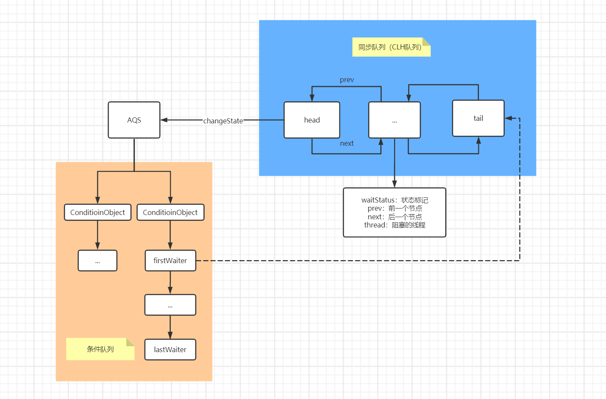
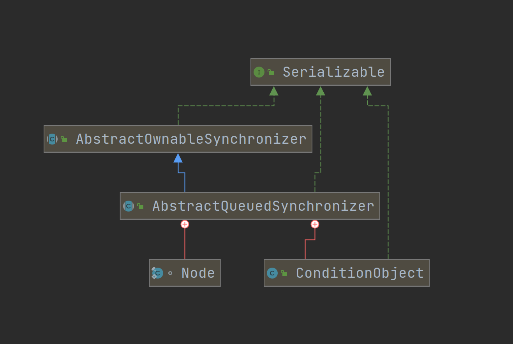

>本文假设您已了解juc包下的部分常用api

---

## 1. 介绍

---

`AbstractQueuedSynchronizer` 简称AQS，用于实现java的锁机制，及依赖于FIFO结构等待队列的同步器工具，说白了就是一套多线程访问共享资源的同步器框架。

AQS实际上就是通过一个变量 `state` 来表示锁的持有状态，并且加解锁也都是通过**原子的**改变这个状态来达到效果，值在不同的子类中表示的含义各不相同。

AQS内部存在两种队列，一个是同步队列（CLH队列，双向链表），存放阻塞待获取锁的线程，排队获取锁。另一个是条件队列（单向链表），存放被`await()`阻塞的线程，等待`signal()`/`signalAll()`。

AQS支持共享和排他两种模式。子类会根据需要实现对应的模式的方法，两种模式也有同时支持的情况，例如`ReentrantReadWriteLock`。即使在不同模式下，等待的线程也共享相同的同步队列。


juc中对该类的具体实现：


主要在锁及同步工具中使用了AQS，线程池中的`Worker`也对其进行了较简单的实现。


## 2. 详细原理

---





**同步队列**

以`Lock`举例，当前线程尝试获取锁时，会查看同步队列中是否已经存在节点，有的话就会被包装为一个Node节点，进行排队，否则会直接尝试获取锁，即尝试改变`state`。这里用**尝试**是因为改变state的操作可能会失败，以上讲的是公平锁的情况。非公平锁的话，会直接先尝试获取锁，尝试失败则进入同步队列进行排队。

同步队列中永远都是头节点会被唤醒，并且其他节点会进入阻塞状态。释放锁的时候会将下一个节点置为head节点，并唤醒对应的线程，让其尝试获取锁。

**条件队列**

条件队列的情况，通过`condition.await()`的线程会被包装为Node节点，从尾部插入到对应condition对象的队列中，进行阻塞，调用`signal()`方法后，会将其第一个节点转移到同步队列中，等待获取锁，这一点和`Object.notify()`的机制不一样。调用`signalAll()`方法后，会将当前condition对象中的条件队列中的所有节点依次转移到同步队列中，并进行阻塞，等待获取锁。

**CLH队列**

AQS的同步队列使用了CLH队列的变体，CLH锁不是用来自旋的，而是变为阻塞同步器，但是使用相同的基本策略，即在节点中保存关于线程的一些控制信息。每个节点中的 **status** 字段记录一个线程是否应该阻塞。当前一个节点被释放时，后一个节点将收到信号。否则，队列的每个节点都充当一个特定通知类型的监视器，持有一个等待被唤醒的线程。如果唤醒的线程在队列中处于第一个位置，它可能会尝试获取锁。但是并不能保证成功，它只给予尝试的权利（非公平）。因此，当前发布的竞争者线程可能需要重新等待。
要将其编入CLH锁，需要将其作为新的节点并原子的设置到队列尾部。要退出队列，只需设置head字段。更新head节点时需要做更多的工作来确定谁是下一个节点，部分原因是要处理由于超时和中断可能导致的取消。"prev" 链接(在原来的CLH锁中没有使用)，主要用于处理CANCEL状态的节点。如果一个节点被CANCEL，它的后继节点(通常)会被重新连接到一个未取消的前任节点。我们也使用 "next" 链接去执行阻塞机制。每个节点的线程id保存在它自己的节点中，因此前身通过遍历下一个链接来通知下一个节点唤醒它，以确定它是哪个线程。CLH队列需要一个虚拟头节点才能启动。但不会在构建AQS时创建它们，因为如果没有竞争，就会浪费精力。相反，构造节点并在第一次争用时设置头和尾指针。

条件队列使用相同的节点，但使用额外的链接。条件只需要简单(非并发)链接队列中的节点，因为它们只在独占状态下才被访问。


predecessor：前继者
successor：后继者


## 3. AQS类结构

----





父类仅存放了一个排他锁持有的线程引用，方便监控锁持有情况。

```java
public abstract class AbstractOwnableSynchronizer implements java.io.Serializable {

    protected AbstractOwnableSynchronizer() { }

    private transient Thread exclusiveOwnerThread; // 排他锁持有的线程

    protected final void setExclusiveOwnerThread(Thread thread) {
        exclusiveOwnerThread = thread;
    }

    protected final Thread getExclusiveOwnerThread() {
        return exclusiveOwnerThread;
    }
}
```


AQS内部存在两个内部类，`Node`代表了队列的一个个节点，封装了线程对象，`ConditionObject`为条件队列使用对象，一个condition对象代表一个条件队列，用于类似通知唤醒机制的场景。

```java
public abstract class AbstractQueuedSynchronizer
    extends AbstractOwnableSynchronizer
    implements java.io.Serializable {

    private transient volatile Node head; // 同步队列的头节点
    private transient volatile Node tail; // 同步队列的尾节点

    private volatile int state; // 锁持有状态，在不同的场景下用不同的值表示

    static final long spinForTimeoutThreshold = 1000L; // 自旋获取锁的超时时间阈值（纳秒）

    static final class Node { ... } // 组成队列的节点对象

    public class ConditionObject implements Condition, java.io.Serializable { ... } // 条件队列使用对象

}
```

此类的序列化只存储维护状态的底层原子整数，因此反序列化的对象具有空线程队列。需要序列化性的典型子类将定义一个readObject方法，该方法在反序列化时将其恢复到已知的初始状态。


可以实现的抽象方法有五个：

- `tryAcquire`：获取排他锁
- `tryRelease`：释放排他锁
- `tryAcquireShared`：获取共享锁
- `tryReleaseShared`：释放共享锁
- `isHeldExclusively`：判断当前AQS是否为排他模式

整体设计使用了模板方法模式，将获取锁的逻辑留给子类实现，默认实现会抛异常，子类的实现需要保证线程安全，一般是简短而非阻塞的，并且对**state**的操作必须保证原子性。AQS中也提供了操作的方法：

- `getState`：获取当前state
- `setState()`：设置state（主要在持有排他锁的情况下使用）
- `compareAndSetState()`：通过CAS原子的设置state，可能失败

类中的其他方法提供了排队和阻塞机制，子类一般定义为一个内部帮助类来实现外部类的同步。


> 公平机制：
>
> 因为检查获取锁是在进入队列之前调用的，所以一个新获取的线程可能会跑到阻塞和排队的其他线程之前。然而，如果需要的话，可以定义`tryAcquire()`和/或`tryAcquireShared()`通过内部调用一个或多个检查方法来禁用这种机制，从而提供一个公平的FIFO队列。大多数公平同步器都可以实现`tryAcquire()`方法来返回**false**（通过调用`hasQueuedPredecessors()`）。


`Node`的结构（两种队列中都使用该Node作为节点）

```java
static final class Node {
    static final Node SHARED = new Node(); // 标记共享模式
    static final Node EXCLUSIVE = null; // 标记排他模式

    static final int CANCELLED =  1; // 线程被中断、抛异常或锁等待超时等情况。取消状态节点的线程不会再次阻塞。
    // 为了避免竞争，acquire方法必须首先表明它们需要一个信号，然后重试原子获取，如果失败，则阻塞。
    static final int SIGNAL    = -1; // 标记当前结点在释放或取消时会唤醒下一个节点
    static final int CONDITION = -2; // 节点在条件队列上
    
    // 应将releaseShared的节点传播到其他节点。这是在doReleaseShared中设置的(仅针对头部节点)，以确保传播继续，即使其他操作已经干预。
	// 0以上数值仅仅是用来简化使用的。非负值意味着节点不需要发出信号。因此，大多数代码不需要检查特定的值，只需要检查符号。
    
    static final int PROPAGATE = -3; // 共享锁操作时标记传播唤醒下一个共享节点
    
    // 对于普通同步节点，字段初始化为0。对于条件节点，字段初始化为CONDITION。
    //它使用CAS（或者在可能的情况下，无条件的volatile写）进行修改。

    volatile int waitStatus; // 指示节点的状态
    volatile Node prev;
    volatile Node next;
    volatile Thread thread; // 存放阻塞的线程

    // 在条件队列上会作为下一个节点的指针
    // 在同步队列上仅作为节点的模式使用，判断是共享模式（SHARED）还是排他模式（EXLUSIVE）
    Node nextWaiter;

    Node() { // 特殊节点使用，如头结点
    }
    Node(Thread thread, Node mode) { // 添加节点到同步队列中使用
        this.nextWaiter = mode;
        this.thread = thread;
    }
    Node(Thread thread, int waitStatus) { // 添加节点到条件队列中使用
        this.waitStatus = waitStatus;
        this.thread = thread;
    }
    
    // ...
}
```


`ConditionObject`的结构

```java
public class ConditionObject implements Condition, java.io.Serializable {
    // 条件队列的头结点
    private transient Node firstWaiter;
    // 条件队列的尾结点
    private transient Node lastWaiter;
    // 只能通过AQS的子类构造
    public ConditionObject() { }

    // 线程被中断时使用
    private static final int REINTERRUPT =  1; // 重新标记线程被中断
    private static final int THROW_IE    = -1; // 抛出中断异常

    // ...
}
```

`ConditionObject`对象，可以用作条件由子类实现支持排他模式的`isHeldExclusively()`方法来报告同步器是否只让当前线程持有


## 4. 前提知识

---

**CAS**

AQS内部的原子操作都是采用CAS实现的（Compare And Swap 比较和交换）

```java
int a = 0;
int b = 1;
if (a == 0) {
	b = a;
}
```

因为上面的CAS操作并不是原子的，多线程访问会产生并发问题，加锁又会影响性能，所以jdk中的`Unsafe`提供了一些原子CAS操作的实现：compareAndSwapXXX，可以理解为直接将所有操作合并，发送一条cpu指令，达到原子操作的效果。


**LockSupport**

线程操作工具，方便控制线程的阻塞、唤醒，是直接针对于线程的操作。最终还是调用的`Unsafe`的api

和Object的wait/notify相比：

- 不需要锁就可以阻塞线程
- 能唤醒指定的线程，而非notify的随机唤醒

使用：调用静态方法 `park()`、`unpark(Thread)` 即可


## 5. 排他模式方法

---

### 5.1. acquire

获取一个排他锁，线程不会被中断

```java
public final void acquire(int arg) { // arg为加锁的数量，即增加state的大小，暂时可以理解为1
    if (!tryAcquire(arg) && // 子类实现，判断当前线程是否能获取到锁
        acquireQueued(addWaiter(Node.EXCLUSIVE), arg)) // 获取锁的核心逻辑，入队一个排他模式的Node
        selfInterrupt(); // 获取锁处于等待时被中断，则在线程被唤醒后标记线程中断（仅仅是标记）
}

static void selfInterrupt() {
    Thread.currentThread().interrupt();
}
```

节点的入队操作

head节点通过setHead方法设置，next节点通过enq方法设置

```java
// 添加一个同步队列节点，给定mode为SHARED或EXCLUSIVE
private Node addWaiter(Node mode) {
    Node node = new Node(Thread.currentThread(), mode);
    // 此处为快速的尝试添加节点，优化
    Node pred = tail;
    if (pred != null) {
        node.prev = pred;
        if (compareAndSetTail(pred, node)) {
            pred.next = node;
            return node;
        }
    }
    
    // 尝试失败则走完全的入队逻辑
    enq(node);
    return node;
}

// 自旋的将新的node插入到同步队列的尾部（enq: enqueue 入队）
private Node enq(final Node node) {
    for (;;) {
        Node t = tail;
        if (t == null) { // 懒初始化
            if (compareAndSetHead(new Node()))
                tail = head; // 初始化时，将head和tail指向相同的新节点
        } else {
            // 设置tail节点
            node.prev = t;
            if (compareAndSetTail(t, node)) { // 将tail节点原子的设置为node
                t.next = node;
                return t;
            }
        }
    }
}
```

看下核心实现

大体逻辑：获取当前节点，判断是否前一个节点为head节点（表示当前节点为同步队列的第一个需要唤醒的节点），是的话，则尝试获取锁，否则进入阻塞状态，获取锁失败也会进行阻塞，成功则直接返回。

```java
final boolean acquireQueued(final Node node, int arg) {
    boolean failed = true; // 标记线程是否有中断标记
    try {
        boolean interrupted = false;
        for (;;) {
            final Node p = node.predecessor(); // 获取节点的前一个节点
            
            // 头部，并且获取到锁的情况
            
            if (p == head && tryAcquire(arg)) { // 前一个节点为head节点，并且抢到锁了
                setHead(node); // 把自己设置为head
                p.next = null; // 帮助gc
                failed = false;
                return interrupted; // 加锁完成，返回线程是否在阻塞时被中断
            }
            
            // 未获取到锁时的阻塞情况
            
            // 判断当前节点（线程）是否应该被阻塞（就是判断waitStatus状态是否为SINGAL）
            if (shouldParkAfterFailedAcquire(p, node) &&
                parkAndCheckInterrupt()) // 阻塞当前线程（被唤醒后会再次循坏尝试获取锁）
                interrupted = true;
        }
    } finally {
        if (failed)
            cancelAcquire(node); // 删除同步队列中的当前节点和后继的为CANCEL状态的节点
    }
}
```

设置头结点

```java
// 入队操作使用，仅当node的前一个节点为head节点时被调用
private void setHead(Node node) {
    head = node; // 头部设置为当前节点
    node.thread = null; // 因为此时头部节点的线程已处于获取锁状态，不再需要线程的引用，方便gc
    node.prev = null; // 方便gc
}
```


### 5.2. acquireInterruptibly

获取排他锁，线程会被中断，和`acquire`不同的地方就一行

```java
public final void acquireInterruptibly(int arg)
        throws InterruptedException {
    if (Thread.interrupted())
        throw new InterruptedException();
    if (!tryAcquire(arg))
        doAcquireInterruptibly(arg);
}

private void doAcquireInterruptibly(int arg)
    throws InterruptedException {
    final Node node = addWaiter(Node.EXCLUSIVE);
    boolean failed = true;
    try {
        for (;;) {
            final Node p = node.predecessor();
            if (p == head && tryAcquire(arg)) {
                setHead(node);
                p.next = null;
                failed = false;
                return;
            }
            if (shouldParkAfterFailedAcquire(p, node) &&
                parkAndCheckInterrupt())
                throw new InterruptedException(); // 如果线程被中断，则直接抛出中断异常，而不是标记
        }
    } finally {
        if (failed)
            cancelAcquire(node);
    }
}
```


### 5.3. tryAcquireNanos

指定时间内尝试获取排他锁

大体逻辑：线程获取锁成功则直接返回，否则在线程获取锁失败进入阻塞时，阻塞指定超时时间，超时后抛出异常。在超时期间被唤醒并尝试获取锁，成功则直接返回，否则重新计算超时时间。

```java
public final boolean tryAcquireNanos(int arg, long nanosTimeout)
        throws InterruptedException {
    if (Thread.interrupted())
        throw new InterruptedException();
    return tryAcquire(arg) || // 获取成功，直接返回
        doAcquireNanos(arg, nanosTimeout); // 指定时间内获取锁的核心逻辑
}

private boolean doAcquireNanos(int arg, long nanosTimeout)
        throws InterruptedException {
    if (nanosTimeout <= 0L)
        return false;
    final long deadline = System.nanoTime() + nanosTimeout; // 先计算好超时时间
    final Node node = addWaiter(Node.EXCLUSIVE);
    boolean failed = true;
    try {
        for (;;) {
            final Node p = node.predecessor();
            if (p == head && tryAcquire(arg)) {
                setHead(node);
                p.next = null;
                failed = false;
                return true;
            }
            nanosTimeout = deadline - System.nanoTime(); // 当前线程阻塞时间
            if (nanosTimeout <= 0L) // 超时后再尝试获取锁失败后会走这里
                return false;
            if (shouldParkAfterFailedAcquire(p, node) &&
                // 如果剩余的时间大于自旋超时阈值，则阻塞，否则持续自旋尝试获取锁
                nanosTimeout > spinForTimeoutThreshold)
                LockSupport.parkNanos(this, nanosTimeout);
            if (Thread.interrupted())
                throw new InterruptedException(); // 会抛中断异常
        }
    } finally {
        if (failed)
            cancelAcquire(node);
    }
}
```


### 5.4. release

释放排他锁，逻辑很简单

大体逻辑：获取head节点，并唤醒head.next节点存放的线程

```java
public final boolean release(int arg) {
    if (tryRelease(arg)) { // 子类尝试释放锁
        Node h = head; // head为当前线程
        if (h != null && h.waitStatus != 0)
            unparkSuccessor(h); // 直接唤醒后一个线程（同步看上面acquire阻塞线程被唤醒后的逻辑）
        return true;
    }
    return false;
}

private void unparkSuccessor(Node node) {

    // 将当前节点设置为正常同步状态
    int ws = node.waitStatus;
    if (ws < 0)
        compareAndSetWaitStatus(node, ws, 0);

    // 获取节点的下一个节点
    Node s = node.next;
    if (s == null || s.waitStatus > 0) { // 后继节点为CANCEL状态或为null
        s = null;
        for (Node t = tail; t != null && t != node; t = t.prev)
            if (t.waitStatus <= 0) // 从后向前寻找非CANCEL状态的节点
                s = t;
    }
    if (s != null)
        LockSupport.unpark(s.thread); // UNSAFE进行唤醒
}
```


## 6. 共享模式方法

---

较排他模式相比，逻辑稍微复杂点

### 6.1. acquireShare

获取共享锁，不会被中断

大体逻辑：入队一个共享节点，获取锁成功时，会同步唤醒后续的可能存在的共享节点

```java
public final void acquireShared(int arg) {
    if (tryAcquireShared(arg) < 0) // 子类判断当前线程是否成功获取共享锁，失败返回负数
        doAcquireShared(arg); // 获取共享锁核心逻辑
}

private void doAcquireShared(int arg) {
    final Node node = addWaiter(Node.SHARED); // 入队共享模式的节点
    boolean failed = true;
    try {
        boolean interrupted = false;
        for (;;) {
            final Node p = node.predecessor();
            if (p == head) {
                int r = tryAcquireShared(arg);
                if (r >= 0) {

                    // 和上面acquire的不同之处在这
                    // 设置头节点后，会尝试唤醒后继的共享节点
                    setHeadAndPropagate(node, r);
                    p.next = null;
                    if (interrupted)
                        selfInterrupt();
                    failed = false;
                    return;
                }
            }
            if (shouldParkAfterFailedAcquire(p, node) &&
                parkAndCheckInterrupt())
                interrupted = true;
        }
    } finally {
        if (failed)
            cancelAcquire(node);
    }
}
```


```java
private void setHeadAndPropagate(Node node, int propagate) {
    Node h = head;
    setHead(node); // 设置head节点

    // 判断后继节点是否需要被唤醒，主要是通过propagate判断
    if (propagate > 0 || h == null || h.waitStatus < 0 ||
        (h = head) == null || h.waitStatus < 0) {
        Node s = node.next;
        if (s == null || s.isShared()) // 校验后继节点的模式
            doReleaseShared(); // 这边会唤醒下一个共享节点
    }
}
```


```java
private void doReleaseShared() {
    for (;;) {
        Node h = head;
        if (h != null && h != tail) {
            int ws = h.waitStatus;
            if (ws == Node.SIGNAL) {
                // 将当前节点设置为正常同步状态，CAS状态失败会不断重试
                if (!compareAndSetWaitStatus(h, Node.SIGNAL, 0))
                    continue;
                unparkSuccessor(h); // 唤醒后继节点中的线程
            }
            // 不需要释放后继节点，则仅标记PROPAGATE，确保锁释放完毕
            else if (ws == 0 &&
                     !compareAndSetWaitStatus(h, 0, Node.PROPAGATE))
                continue;
        }
        if (h == head) // head没有被其他线程动过的话，直接返回
            break;
    }
}
```


### 6.2. acquireSharedInterruptibly

获取共享锁，可以被中断

整体逻辑几乎都一样，唯一的区别就是标记改为抛出异常

```java
public final void acquireSharedInterruptibly(int arg)
        throws InterruptedException {
    if (Thread.interrupted())
        throw new InterruptedException();
    if (tryAcquireShared(arg) < 0)
        doAcquireSharedInterruptibly(arg);
}
```


### 6.3. tryAcquireSharedNanos

指定时间内获取共享锁

整体逻辑几乎都一样，唯一的区别就是会校验超时

```java
public final boolean tryAcquireSharedNanos(int arg, long nanosTimeout)
        throws InterruptedException {
    if (Thread.interrupted())
        throw new InterruptedException();
    return tryAcquireShared(arg) >= 0 ||
        doAcquireSharedNanos(arg, nanosTimeout);
}
```


### 6.4. releaseShared

释放共享锁

```java
public final boolean releaseShared(int arg) {
    if (tryReleaseShared(arg)) {
        doReleaseShared(); // 走上面acquireShare已有的逻辑释放下一个节点
        return true;
    }
    return false;
}
```


## 7. 条件队列

---

### 7.1. await

将节点放入到阻塞队列中，等待signal/signalAll将其唤醒

大体逻辑：

1、将当前线程封装为一个Node节点，添加到条件队列中

2、释放当前线程持有的排他锁

3、校验当前线程是否在同步队列中（第一次肯定不在），不在则将当前线程阻塞（条件队列阻塞），否则直接进行第5步

4、signal、signalAll方法会唤醒条件队列的第一个节点，线程被释放后，会检查阻塞时的中断情况，进行相应标记

5、线程被唤醒后（此时该节点必定在同步队列上），直接尝试获取锁，成功则返回，否则阻塞（同步队列阻塞）

6、获取锁成功后，先释放等待队列中的无效节点，再对中断标记进行相应的处理（标记中断或抛异常或donothing）

```java
public final void await() throws InterruptedException {
    if (Thread.interrupted())
        throw new InterruptedException();
    Node node = addConditionWaiter();  // 添加节点到等待队列中
    int savedState = fullyRelease(node); // 将当前锁的状态释放掉，返回释放前的状态，用于再次获取锁
    int interruptMode = 0;
    while (!isOnSyncQueue(node)) { // 当前节点不在同步队列中，需要进行阻塞，等待singal/signalAll唤醒
        LockSupport.park(this); // single/signalAll会将线程放入同步队列中并唤醒线程
        // 校验线程阻塞时是否被中断，被中断时会将该节点放入到同步队列中
        if ((interruptMode = checkInterruptWhileWaiting(node)) != 0)
            break;
    }
    // 当前节点进入同步队列尝试获取锁（即使节点被中断，也需要获取锁才能继续执行）
    if (acquireQueued(node, savedState) && interruptMode != THROW_IE)
        interruptMode = REINTERRUPT;
    // 处理等待队列中无效的CANCEL节点
    if (node.nextWaiter != null)
        unlinkCancelledWaiters();
    // -1抛异常，1标记中断
    if (interruptMode != 0)
        reportInterruptAfterWait(interruptMode);
}
```

将当前线程添加到条件队列中

```java
private Node addConditionWaiter() {
    Node t = lastWaiter;
    if (t != null && t.waitStatus != Node.CONDITION) {
        unlinkCancelledWaiters(); // 从后向前遍历清除CANCEL状态的结点
        t = lastWaiter;
    }

    // 添加新的同步节点
    Node node = new Node(Thread.currentThread(), Node.CONDITION);
    if (t == null)
        firstWaiter = node;
    else
        t.nextWaiter = node;
    lastWaiter = node;
    return node;
}
```

释放当前节点持有的锁

```java
final int fullyRelease(Node node) {
    boolean failed = true;
    try {
        int savedState = getState();
        if (release(savedState)) { // 调用释放锁逻辑，支持Condition的子类，需要校验锁持有状态
            failed = false;
            return savedState;
        } else {
            throw new IllegalMonitorStateException();
        }
    } finally {
        if (failed)
            node.waitStatus = Node.CANCELLED; // 失败标记CANCEL
    }
}
```

检查阻塞时的中断

```java
private int checkInterruptWhileWaiting(Node node) {
    return Thread.interrupted() ?
        (transferAfterCancelledWait(node) ? THROW_IE : REINTERRUPT) : // 被中断，需要先入同步队列
        0; // 线程没中断，直接返回0
}
```

将中断状态的节点转移到同步队列中，等待唤醒后执行中断标记或抛异常

```java
final boolean transferAfterCancelledWait(Node node) {
    if (compareAndSetWaitStatus(node, Node.CONDITION, 0)) { // 标记正常同步状态，并入队
        enq(node);
        return true; // 抛异常
    }

    // signal()先改变了状态，自旋等待入队结束
    while (!isOnSyncQueue(node))
        Thread.yield();
    return false; // 标记中断
}
```


剩下的await的多个版本，逻辑类似，就不介绍了


### 7.2. signal

唤醒条件队列中的第一个节点

大体逻辑：校验当前线程是否持有锁，获取firstWaiter，将节点放入到同步队列后，唤醒对应的线程

```java
public final void signal() {
    if (!isHeldExclusively()) // 没有持有锁，直接抛异常
        throw new IllegalMonitorStateException();
    Node first = firstWaiter;
    if (first != null)
        doSignal(first); // 将等待队列中的头结点唤醒，和synchronized不一样
}
```


```java
private void doSignal(Node first) {
    do {
        // 解除引用，方便gc
        if ( (firstWaiter = first.nextWaiter) == null)
            lastWaiter = null;
        first.nextWaiter = null;
    } while (!transferForSignal(first) && // 转移等待队列中被唤醒的节点到同步队列中
             (first = firstWaiter) != null); // 失败重试
}
```


```java
final boolean transferForSignal(Node node) {
    // 失败，说明节点已被置为CANCEL状态
    if (!compareAndSetWaitStatus(node, Node.CONDITION, 0))
        return false;

    // 节点入队
    Node p = enq(node);
    int ws = p.waitStatus;
    // 入队设置状态失败，需要唤醒线程并重新同步（一般不会走这）
    if (ws > 0 || !compareAndSetWaitStatus(p, ws, Node.SIGNAL))
        LockSupport.unpark(node.thread);
    return true;
}
```


### 7.3. signalAll

整合逻辑和signal一样，只是将唤醒单个节点变为了唤醒所有节点

```java
public final void signalAll() {
    if (!isHeldExclusively())
        throw new IllegalMonitorStateException();
    Node first = firstWaiter;
    if (first != null)
        doSignalAll(first);
}
```


```java
private void doSignalAll(Node first) {
    lastWaiter = firstWaiter = null;
    do {
        Node next = first.nextWaiter;
        first.nextWaiter = null;
        transferForSignal(first);
        first = next;
    } while (first != null);
}
```


## 8. Lock实现

---


把AQS扒开看完后，该看看锁对它的实现了吧


```java
public class ReentrantLock implements Lock, java.io.Serializable {

    // 子类作为内部帮助类
    private final Sync sync;

    // 还是抽象类，因为 ReentrantLock 支持公平锁和非公平锁
    abstract static class Sync extends AbstractQueuedSynchronizer {

        // 具体上锁逻辑交由子类实现
        abstract void lock();

        // 非公平的尝试获取锁
        final boolean nonfairTryAcquire(int acquires) { // acquires=1，表示上一次锁
            final Thread current = Thread.currentThread();
            int c = getState();
            if (c == 0) { // 0表示没有线程获取锁
                // 非公平就体现在这了，此刻没有上锁时，直接尝试上锁，并不会校验同步队列上是否存在阻塞的线程
                // true成功上锁后，false上锁失败，直接返回
                if (compareAndSetState(0, acquires)) {
                    setExclusiveOwnerThread(current); // 设置当前线程为排他锁的持有线程（AQS父类方法）
                    return true;
                }
            }
            else if (current == getExclusiveOwnerThread()) { // 当前线程为排他锁的持有线程
                int nextc = c + acquires;
                if (nextc < 0) // 一般不会发生
                    throw new Error("Maximum lock count exceeded");
                setState(nextc); // 加上acquires后重新设置state，意味着该锁时可重入锁，每次上锁仅仅是将state+1
                return true;
            }
            return false; // 已被上锁，获取锁失败
        }

        protected final boolean tryRelease(int releases) { // releases=1，表示释放一次锁
            int c = getState() - releases;
            // 释放时，当前线程不是排他锁的持有线程，则抛异常
            if (Thread.currentThread() != getExclusiveOwnerThread())
                throw new IllegalMonitorStateException();
            boolean free = false;
            if (c == 0) { // 释放完毕，state=0，表示解锁完毕（可重入的上锁多次时，需要相应次数的release操作）
                free = true;
                setExclusiveOwnerThread(null); // 删除排他锁持有线程的引用
            }
            setState(c); // 设置锁状态
            return free;
        }

        // 判断排他锁持有的线程是否为当前线程
        protected final boolean isHeldExclusively() {
            return getExclusiveOwnerThread() == Thread.currentThread();
        }

        // 返回当前AQS内的条件对象
        final ConditionObject newCondition() {
            return new ConditionObject();
        }

        // ...
    }

    // 非公平锁的实现
    static final class NonfairSync extends Sync {

        final void lock() {
            // 此判断逻辑表示尝试先获取一次锁
            if (compareAndSetState(0, 1)) // CAS，将state从0变1，表示上一次锁
                setExclusiveOwnerThread(Thread.currentThread()); // 设置排他线程
            // 失败则入队（同步队列）
            else
                acquire(1);
        }

        protected final boolean tryAcquire(int acquires) {
            return nonfairTryAcquire(acquires);
        }
    }

    // 公平锁的实现
    static final class FairSync extends Sync {

        final void lock() {
            acquire(1); // 公平锁，就直接走入队逻辑了，并不会先尝试获取一下锁
        }

        // 公平尝试上锁
        protected final boolean tryAcquire(int acquires) {
            final Thread current = Thread.currentThread();
            int c = getState();
            if (c == 0) {
                // 没有线程上锁时，会校验同步队列中，是否当前线程为第一个等待唤醒的线程
                if (!hasQueuedPredecessors() &&
                    compareAndSetState(0, acquires)) {
                    setExclusiveOwnerThread(current);
                    return true;
                }
            }
            else if (current == getExclusiveOwnerThread()) {
                int nextc = c + acquires;
                if (nextc < 0)
                    throw new Error("Maximum lock count exceeded");
                setState(nextc);
                return true;
            }
            return false;
        }
    }

    // ...
}
```


最后看下`Lock`的API实现，是不是一切都豁然开朗了~~

```java
public ReentrantLock() {
    sync = new NonfairSync(); // 默认非公平可重入锁
}

public ReentrantLock(boolean fair) {
    sync = fair ? new FairSync() : new NonfairSync();
}

public void lock() {
    sync.lock();
}

public void lockInterruptibly() throws InterruptedException {
    sync.acquireInterruptibly(1);
}

public boolean tryLock() {
    return sync.nonfairTryAcquire(1); // tryLock设计上就是非公平的
}

public boolean tryLock(long timeout, TimeUnit unit)
        throws InterruptedException {
    return sync.tryAcquireNanos(1, unit.toNanos(timeout));
}

public void unlock() {
    sync.release(1);
}

public Condition newCondition() {
    return sync.newCondition();
}
```


## 9. 总结

jdk5之前的线程同步只能使用`synchronized`，效率十分低下，jdk5之后提供了对并发有更好支持的锁机制，两者的设计几乎一样，synchronized使用`WaitSet`和`EntryList`作为线程的等待队列和同步队列，使用`ObjectWaiter`作为Node节点对象，唯一的区别就是AQS中能存在多个Condition对象，而`synchronized`只有一个`WaitSet`。

但是在jdk的每个版本，都对`synchronized`关键字做了优化，两者间的性能差距已经越来越小了。


> 彩蛋：
>
> ReentrantLock通过state来表示上锁的数量，
>
> ReentrantReadWriteLock则会把state劈成两半，分别表示读锁持有数（高16位）和写锁持有数（低16位），
>
> 那线程池是不是也有类似的机制呢~~


