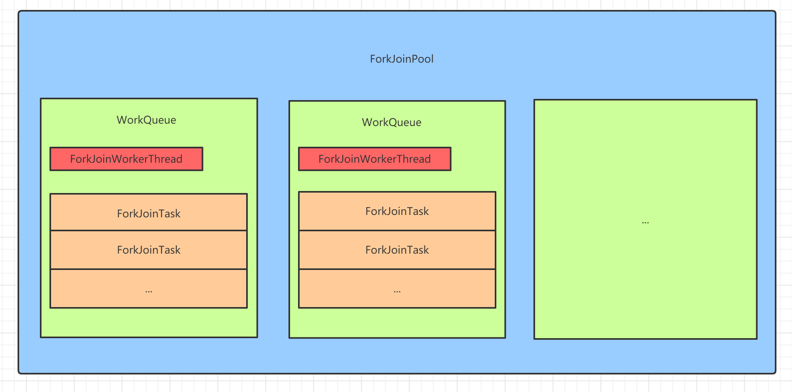
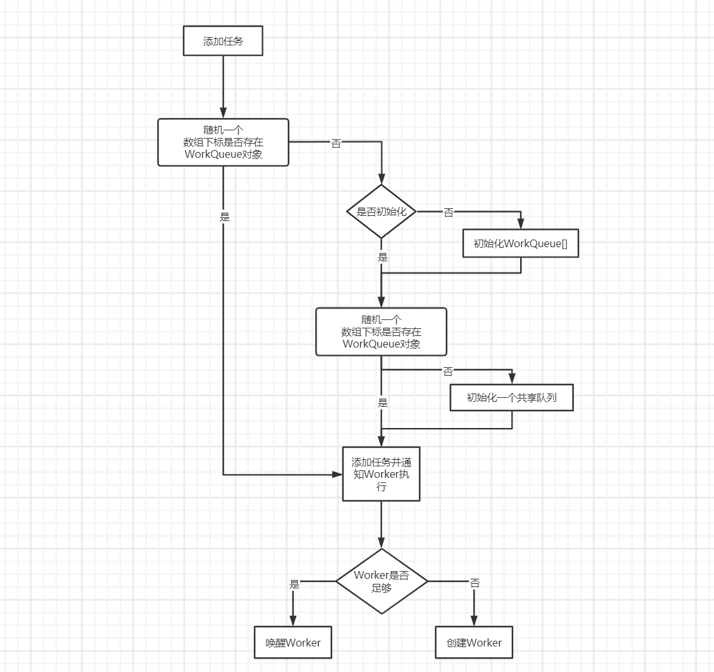
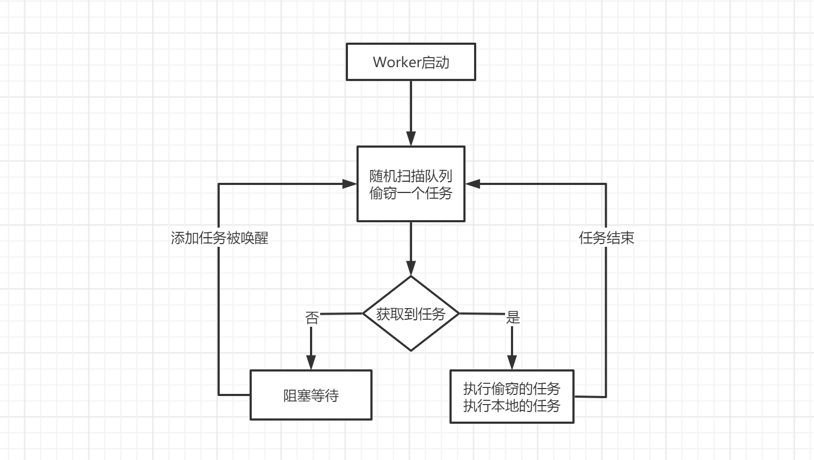
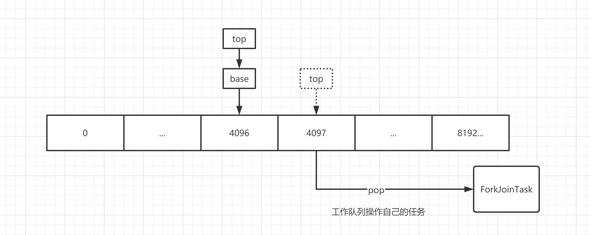
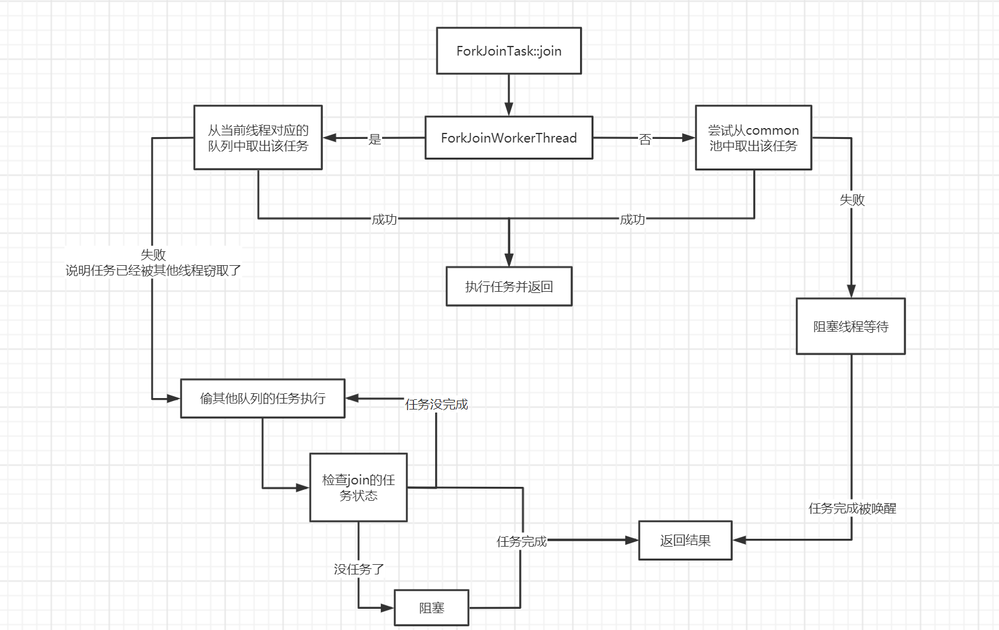

## ForkJoinPool

`ForkJoinPool`作为jdk7出来的另一个线程池，主要实现了**分而治之**的思想。

通俗的说，就是将大型复杂任务进行递归的分解，直到任务足够小才直接执行，从而递归的返回各个足够小的任务的结果汇集成一个大任务的结果，依次类推得出最初提交的那个任务的结果，这和方法的递归调用思想是一样的。


`ForkJoinPool`为了提高任务的并行度和吞吐量做了非常多而且复杂的设计实现，其中最重要的就是**任务窃取**机制。

`ForkJoinPool`适合**CPU密集型**的任务，如果任务中存在 I/O，线程阻塞等情况时，不太推荐使用。


> Stream并行流的底层就是使用的ForkJoinPool


ForkJoinPool的整体结构图



`ForkJoinPool`中存有一个`WorkQueue[]`的引用。

`WorkQueue`也叫任务窃取队列，是`ForkJoinPool`的内部类，拥有两个比较重要的东西：`ForkJoinWorkerThread`和`ForkJoinTask[]`。

`ForkJoinWorkerThread`继承自`Thread`，只持有`ForkJoinPool`和自己的`WorkQueue`的引用，设计出来主要是为了简化使用并支持进一步扩展。

`ForkJoinTask`实现了`Future`接口，是一个只能在`ForkJoinPool`中运行的任务，和`ForkJoinPool`配合使用可以做到任务分支/合并的功能。


两种方式获取`ForkJoinPool`：

**自己构造：**

```java
public ForkJoinPool(
    int parallelism, // 线程并行级别，默认CPU核心数
    ForkJoinWorkerThreadFactory factory, // 线程工厂，无则使用默认的（直接new一个）
    UncaughtExceptionHandler handler, // 线程异常处理器，默认null
    boolean asyncMode); // 队列模式，true:FIFO，适合用于支持池中只有事件风格的异步任务，false:LIFO（默认）
```

**JDK默认提供的实现：**

```java
ForkJoinPool pool = ForkJoinPool.commonPool();
```

默认提供的会在系统启动时构造一个，可通过

- **java.util.concurrent.ForkJoinPool.common.parallelism**

- **java.util.concurrent.ForkJoinPool.common.threadFactory**

- **java.util.concurrent.ForkJoinPool.common.exceptionHandler**

系统属性来覆盖默认设置。通过将parallelism属性设置为0，或让工厂返回null，可以禁用或限制默认池中线程的使用。

> 自己的线程池能shutdown，但官方提供的线程池不会被shutdown


简单的使用有三种方式（支持Runnable、Callable）：

- `execute(ForkJoinTask)`：提交一个任务到池中

- `invoke(ForkJoinTask)`：提交一个任务到池中，并等待结果返回

- `submit(ForkJoinTask)`：提交一个任务到池中，返回ForkJoinTask对象


|                                | Call from non-fork/join clients | Call from within fork/join computations       |
| ------------------------------ | ------------------------------- | --------------------------------------------- |
| Arrange async execution        | execute(ForkJoinTask)           | ForkJoinTask.fork                             |
| Await and obtain result        | invoke(ForkJoinTask)            | ForkJoinTask.invoke                           |
| Arrange exec and obtain Future | submit(ForkJoinTask)            | ForkJoinTask.fork (ForkJoinTasks are Futures) |


添加任务的流程大概是这样的




线程被创建后就进入了循环的执行任务的过程




## WorkQueue

线程池中核心的`WorkQueue[]`是懒加载的，在第一次提交任务时初始化，该数组维护了所有的`WorkQueue`对象，方便了任务的窃取等操作。

`WorkQueue`对象存在两种形式：共享队列，非共享队列

**共享队列**：外部任务提交后放入的队列，我们调用api传入的任务都是外部任务，会被放在共享队列中，共享队列中没有`Thread`，只是任务的载体，专门用来被其他Worker窃取的。

**非共享队列**：也就是每个与线程绑定的队列，队列会与线程一同被创建并注册到线程池中，该队列的任务只有在`ForkJoinWorkerThread`中调用了`ForkJoinTask::fork`的任务才会被放到这里面，暂时可以理解为线程私有的任务。

两种队列在内部几乎没有什么不同，因为不管放哪，任务都有被窃取的可能。

以这种方式将它们分组主要是可以简化和加快任务扫描。


`WorkQueue`中有个重要的`ForkJoinTask[]`对象，存放着当前队列的所有任务，数组默认初始容量为`1 << 13`，不够扩容为2倍，最大容量为`1 << 26`（一般也达不到），超过则抛异常。


数组用两个重要的指针标记：**top**、**base**，初始指向为数组容量的一半。top为插入元素的指针，base为偷窃元素的指针。通过两个指针操作数组中的数据，支持栈和队列结构的数据获取方式。


队列有三种操作方式：

- **push**：入队一个ForkJoinTask

  


- **pop**：出队一个ForkJoinTask

  


- **poll**：偷窃一个ForkJoinTask

  


push和pop是针对于线程私有队列的操作，poll是针对于其他线程的偷窃操作。

共享队列操作时需要加锁，非共享队列操作时不需要。


top和base指针初始为什么会放在中间？我觉得可能是为了减少伪共享产生的性能问题

0-4095是不是就不放元素了？Doug Lea用位运算很巧妙的通过top和base循环的放置元素，并在数组放满时扩容


## ForkJoinTask

`ForkJoinTask`是只能在`ForkJoinPool`中运行的任务，与`ForkJoinPool`关联非常紧密，也是得以实现任务分而治之思想的重要核心。

其中有两个重要的方法`fork()`和`join()`，对应了分支、合并。

因为`ForkJoinTask`是抽象类，官方不推荐直接子类化，相反，提供了三种实现抽象，来支持各自风格的fork/join处理

- `RecursiveTask`：递归执行任务，返回结果

- `RecursiveAction`：递归执行任务，不返回结果

- `CountedCompleter`：计数型的完成当前的操作来触发其他的操作


简单的使用示例：

计算0-100000000相加

```java
public static void main(String[] args) throws Exception {
    CountTask countTask = new CountTask(0, 100000000);
    ForkJoinPool pool = ForkJoinPool.commonPool();
    pool.execute(countTask);
    System.out.println(countTask.get());
}

static class CountTask extends RecursiveTask<Integer> {
    private final int start;
    private final int end;
    private       int result;

    public CountTask(int start, int end) {
        this.start = start;
        this.end = end;
    }

    @Override
    protected Integer compute() {
        int num = end - start;
        if (num <= 1000) {
            for (int i = start; i <= end; i++)
                result += i;
            return result;
        }
        int mid = (end + start) / 2;
        CountTask left = new CountTask(start, mid);
        CountTask right = new CountTask(mid + 1, end);
        left.fork();
        right.fork();
        return right.join() + left.join();
    }
}
```

任务的分割由用户实现，上面的分割逻辑并不是很好，此处仅供演示使用。


`ForkJoinTask::fork`方法就是将调用该方法的任务放到了`ForkJoinPool`中，方便其他线程窃取并执行，逻辑非常简单。

`ForkJoinTask::join`方法会将任务的结果返回，期间会阻塞当前线程等待任务结束，或其他优化行为（比如任务窃取）

流程类似于这样：




## other

这个框架一开始是用于使用工作窃取形式来支持树结构的并行，由于其高扩展的优势，久而久之就支持了更多的使用环境。


静态公共池在静态初始化后始终存在。由于它(或任何其他创建的池)永远都不需要使用，所以我们将初始构造开销和占用空间降到最低，只需要设置大约12个字段，不需要嵌套分配。池中最大线程池为**32767**。


如果存在`SecurityManager`且没有指定工厂，那么默认池将使用`InnocuousForkJoinWorkerThreadFactory`工厂提供没有权限的线程，不属于任何用户定义的`ThreadGroup`，并且在执行任何顶级任务（参见WorkQueue.runTask）后删除所有**threadlocal**。相关机制（主要在ForkJoinWorkerThread中）可能依赖于jvm，并且必须访问特定的线程类字段才能实现此效果。


`ForkJoinPool`内部的`ManagedBlocker`接口支持所适应的同步类型的扩展。


在类`ForkJoinPool`、`ForkJoinWorkerThread`和`ForkJoinTask`之间存在很多表示级耦合。`WorkQueue`字段维护`ForkJoinPool`管理的数据结构，可以直接访问。


`@Contended`注解

- https://blog.csdn.net/hxg117/article/details/78064632

- https://luruipeng.blog.csdn.net/article/details/79645476


工作窃取高吞吐的优势是去中心化，池子本身只用来创建、激活（启用扫描和运行任务）、取消激活、阻塞和终结线程，内部只有很少的属性可以全局的追踪和维护，采用原子的方式维护（不阻塞和使用锁）

基本上所有的原子控制状态使用两个经常被读取的volatile变量作为状态和一致性检查（ctl/config）。


队列的指针是基于索引的操作（简化操作），数组大小必须是2的幂


从队列中取出元素和改变ctl状态需要full-fence CAS ，使用Unsafe volatile形式的读取数组槽，读取其他线程的`WorkQueue`的base/top/array前需要一个volatile load。使用声明"base"索引为volatile的约定，并且总是在其他字段之前读取它。所有者线程必须确保有序的更新，所以写操作必须使用有序的内嵌原语，除非它们可以在其他写操作时使用这些内嵌原语。类似的约定和原理也适用于其他工作队列字段(如"currentSteal")，这些字段只由所有者编写，但被其他人观察到。


`ForkJoinTask`一般运行在`ForkJoinPool`中，当被明确的提交到pool中才会被执行。如果没有开始ForkJoin计算，可以通过fork,invoke和相关的方法开始。一般只要使用fork和join方法即可，但也提供了一些方法用于高级方式。

fork会分配异步执行，join等待执行完毕并提取结果，方法应该尽可能的小并且避免同步或阻塞。

`invokeAll`：会fork一个任务集合并join它们

`isDone`：任务完成了（不区分是否取消或异常）

`isCompletedNormally`：任务完成，没有取消或异常

`isCanceled`：任务取消了，getException会返回一个CancellationException

`isCompletedAbnormally`：任务取消或遭遇异常了，getException会返回CancellationException或遭遇的异常


`ForkJoinTask`类通常不直接子类化。相反，应该子类化一个抽象类，这些类支持特定风格的fork/join处理。具体ForkJoinTask的子类应该在构造函数中初始化声明的参数。


方法join及其变体只适合在完成**依赖无循环**的情况下使用；也就是说，并行计算可以描述为一个**有向无环图**（DAG  directed acyclic graph），否则当任务周期性地等待彼此时，执行可能会遇到死锁。然而，这个框架支持其他方法和技术（例如**Phaser**、**helpQuiesce**和**complete**的使用），这些方法和技术可能用于为静态结构不是dag的问题构建自定义子类。为了支持这种用法，`ForkJoinTask`使用`setForkJoinTaskTag`或`compareAndSetForkJoinTaskTag`原子的标记一个short值，并使用`getForkJoinTaskTag`检查。

创建新的fork/join处理基本风格的开发人员应该最小限度地实现受保护的方法`exec`、`setRawResult`和`getRawResult`，同时引入一个可以在其子类中实现的抽象`complete`方法，可能依赖于这个类提供的其他受保护的方法。

这个类为`Runnable`和`Callable`提供了适配的方法，这可能在混合执行ForkJoinTasks和其他类型的任务时使用。当所有任务都是这种形式时，考虑使用在构造线程池时使用asyncMode。

**int status**表示任务的运行状态，以最小化内存占用并确保原子性（通过CAS）。status初始值为0，并且在完成(complete)后变为负值，在完成后状态有三种：NORMAL、CANCELLED或EXCEPTION。正在被其他线程阻塞等待的任务设置了信号位。完成一个带有信号集的被窃取的任务会通过notifyAll唤醒所有等待者。尽管对于某些目的来说不是最优的，但使用基本的内置等待/通知来利用jvm中的"监视器膨胀"，否则我们就需要模拟它，以避免进一步增加每个任务的簿记开销。我们希望这些监视器是"胖"的，也就是说，不使用偏向锁或轻量级锁技术，所以使用一些奇怪的编码习惯来避免它们，主要是通过安排每个同步块执行一个wait、notifyAll或两者都执行。

这些控制位只占据状态域的上半部分(16位)。较低的位用于用户定义的标签。


## 彩蛋


**不检查的抛出受检异常**


这是在`ForkJoinTask`的源码中看到的，是关于任务异常处理方面的。

依靠泛型限制来逃避编译器对重新抛出未检查异常的检查。

```java
public static RuntimeException rethrow(Throwable e) {
    return uncheckedThrow(e);
}

@SuppressWarnings("unchecked")
private static <T extends Throwable> T uncheckedThrow(Throwable e) throws T {
    throw (T) e;
}
```


