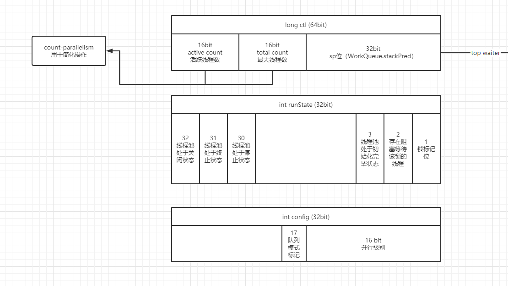
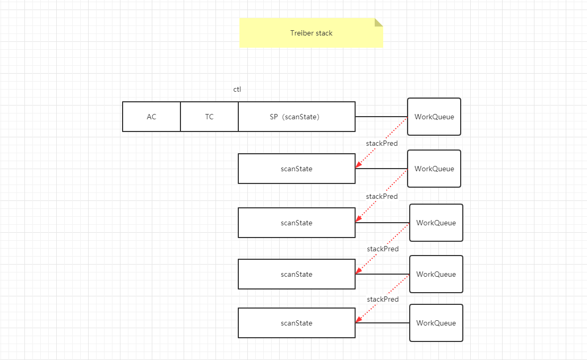
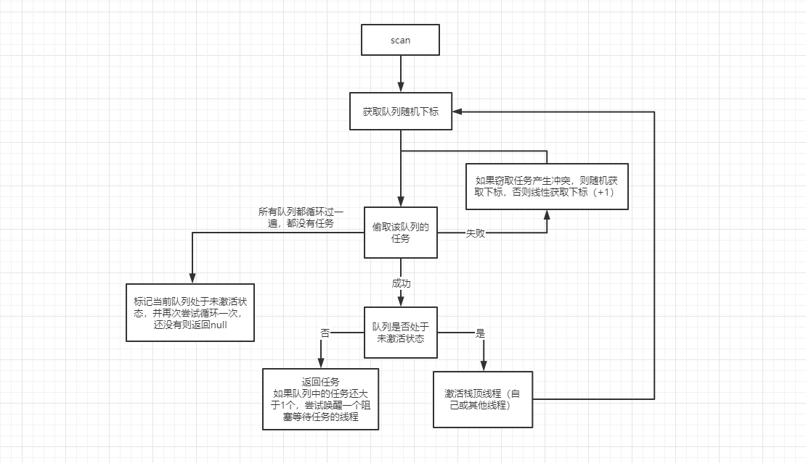
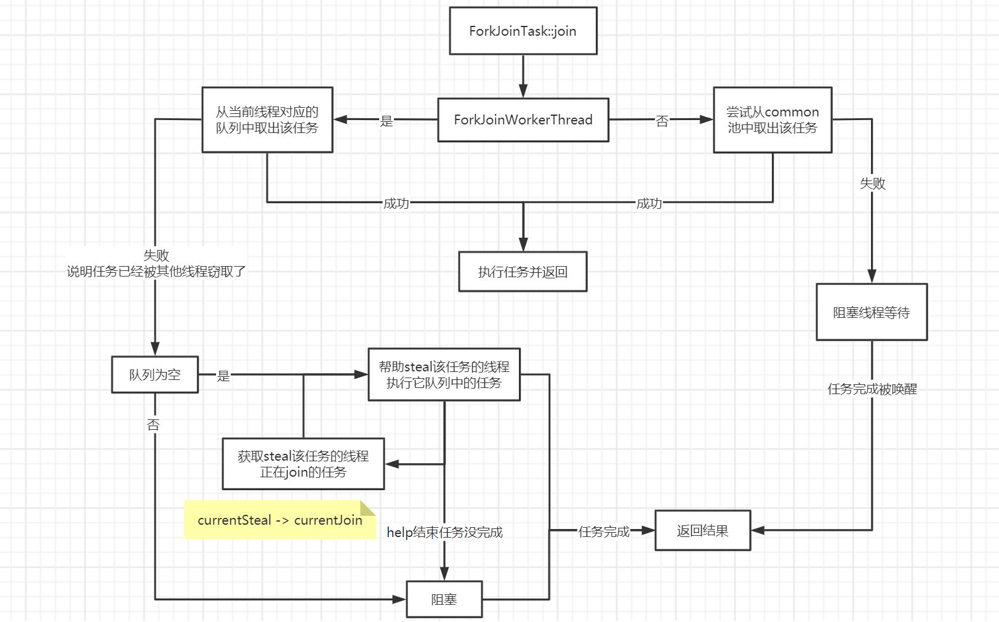
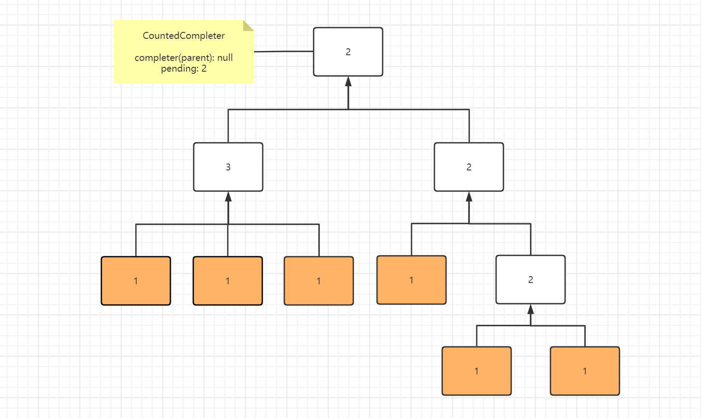

> **ForkJoinPool**的源码比较复杂，前提需要熟悉位运算和[Unsafe](http://hg.openjdk.java.net/jdk8u/jdk8u60/jdk/file/935758609767/src/share/classes/sun/misc/Unsafe.java)工具类，并且对类中的常量和成员变量有一定的了解，看起来才比较轻松。接下来，请Doug Lea开始表演~~~


## 1. 常量 & 成员变量

---


ForkJoinPool和WorkQueue共用的常量

```java
// 掩码和ip的子网掩码很像，起着划分的作用，目的就是用于获取掩码所占位上的值
static final int SMASK        = 0xffff;        // short位的掩码
static final int MAX_CAP      = 0x7fff;        // 最大的工作线程数
static final int EVENMASK     = 0xfffe;        // 偶数的short位的掩码
static final int SQMASK       = 0x007e;        // 外部提交的任务只能放在前64个偶数的WorkQueue槽位

// WorkQueue.scanState 和 ForkJoinPool.ctl的sp位
static final int SCANNING     = 1;             // Worker活跃时的状态（扫描任务/正在执行任务）
static final int INACTIVE     = 1 << 31;       // Worker的激活状态（阻塞或为共享队列表示未激活状态）
static final int SS_SEQ       = 1 << 16;       // 添加版本标记用，唤醒空闲线程避免ABA问题（Treiber stack）

// WorkQueue.config 和 ForkJoinPool.config
static final int MODE_MASK    = 0xffff << 16;   // 队列模式的掩码
static final int LIFO_QUEUE   = 0;				// 同步模式的队列标记（LIFO）
static final int FIFO_QUEUE   = 1 << 16; 		// 异步模式的队列标记（FIFO）
static final int SHARED_QUEUE = 1 << 31;        // 共享队列标记
```


WorkQueue的常量和成员变量

```java
static final class WorkQueue {

    static final int INITIAL_QUEUE_CAPACITY = 1 << 13; // 数组初始容量

    static final int MAXIMUM_QUEUE_CAPACITY = 1 << 26; // 数组最大容量

    volatile int scanState;    // 当前WorkQueue的状态
    int stackPred;             // 前一个待唤醒线程所在WorkQueue的scanState值（也是ctl的sp位）
    int nsteals;               // 窃取任务的数量，统计用
    int hint;                  // 随机数种子和stealer的索引（优化查找）
    int config;                // 当前WorkQueue在池中的数组的索引下标 和 Queue的模式
    volatile int qlock;        // 0表示未上锁，1表示已上锁，小于0表示线程池已终止（terminate）
    volatile int base;         // 被窃取任务时用的指针
    int top;                   // 添加任务用的指针
    ForkJoinTask<?>[] array;
    final ForkJoinPool pool;
    final ForkJoinWorkerThread owner; 	   // 线程对象，共享队列为null
    volatile Thread parker;    			   // 线程被唤醒时使用，== owner
    volatile ForkJoinTask<?> currentJoin;  // 当前Worker正在等待完成的任务
    volatile ForkJoinTask<?> currentSteal; // 当前Worker偷窃的任务

    WorkQueue(ForkJoinPool pool, ForkJoinWorkerThread owner) {
        this.pool = pool;
        this.owner = owner;
        // 将两个指针放置在数组的中心（此时任务数组还没初始化）
        base = top = INITIAL_QUEUE_CAPACITY >>> 1;
    }
    
    // ...省略方法
}
```


ForkJoinPool的常量和成员变量

```java
// ctl的掩码
private static final long SP_MASK    = 0xffffffffL; // 低32位
private static final long UC_MASK    = ~SP_MASK; 	// 高32位

// 活跃线程数（active count）
private static final int  AC_SHIFT   = 48; 					// 活跃线程数的位移数
private static final long AC_UNIT    = 0x0001L << AC_SHIFT; // 活跃线程数的单位
private static final long AC_MASK    = 0xffffL << AC_SHIFT; // 活跃线程数的掩码

// 池中所有的线程数（total count）
private static final int  TC_SHIFT   = 32; 						   // 总线程数的位移数
private static final long TC_UNIT    = 0x0001L << TC_SHIFT; 	   // 总线程数的单位
private static final long TC_MASK    = 0xffffL << TC_SHIFT; 	   // 总线程数的掩码
private static final long ADD_WORKER = 0x0001L << (TC_SHIFT + 15); // 判断是否还需要添加Worker

// 运行状态的标记位
private static final int  RSLOCK     = 1; 		// WorkQueue[]的锁标记位
private static final int  RSIGNAL    = 1 << 1;  // 表示当前池中存在阻塞的线程希望获取runState锁
private static final int  STARTED    = 1 << 2;  // 线程池初始化完毕
private static final int  STOP       = 1 << 29; // 线程池处于STOP状态
private static final int  TERMINATED = 1 << 30; // 线程池处于TERMINATED状态
private static final int  SHUTDOWN   = 1 << 31; // 线程池处于SHUTDOWN状态

volatile long ctl;                   // 主要的线程池控制参数
volatile int runState;               // 线程池运行时的状态，也作为锁使用
final int config;                    // 队列模式和并行级别
// indexSeed确保在需要重新调整大小或取消注册并替换worker之前不会发生冲突，然后保持低碰撞的概率。
int indexSeed;                       // 随机数种子，用来生成WorkQueue的索引
volatile WorkQueue[] workQueues;
final ForkJoinWorkerThreadFactory factory;
final UncaughtExceptionHandler ueh;
final String workerNamePrefix;       // 线程名称前缀（创建线程时加上数组索引表示完整的线程名称）
volatile AtomicLong stealCounter;    // 统计用，也作为runState的锁（没其他变量能用了）

// ...省略一些不太重要的
```





ctl的sp位保存着`WorkQueue`的**scanState**状态，该状态保存着`WorkQueue`所在数组的下标，方便获取`WorkQueue`对象并释放对应的阻塞线程。

空闲（找不到任务进入阻塞状态）的线程会将对应`WorkQueue`的**scanState**放入sp中，并将前一个阻塞线程的**scanState**放入自己的**stackPred**中，保持引用，形成了一种链表结构，又因为阻塞线程是后进先出的，也是一种堆栈结构。

总之，该SP位表示一种无锁并发栈的结构，通过CAS替换栈顶元素达到高并发下的线程安全。





## 2. 初始化线程池

---

类的静态代码块中会初始化一个jdk提供的默认的ForkJoinPool，用户也可以自定义

```java
static {
    // 忽略Unsafe相关

    commonMaxSpares = DEFAULT_COMMON_MAX_SPARES; // 最大补充线程数（256），用于线程阻塞时添加补充线程使用
    defaultForkJoinWorkerThreadFactory =
        new DefaultForkJoinWorkerThreadFactory(); // 内部类，创建线程对象（只是简单的new） 
    modifyThreadPermission = new RuntimePermission("modifyThread"); // 权限控制，可忽略
    common = java.security.AccessController.doPrivileged
        (new java.security.PrivilegedAction<ForkJoinPool>() {
            public ForkJoinPool run() { return makeCommonPool(); }}); // 调用makeCommonPool()构建
    // 并行级别不代表最大的线程数量，代表着同一时间最大的活跃线程数
    int par = common.config & SMASK; // 获取并行级别，至少1
    commonParallelism = par > 0 ? par : 1;
}
```

```java
private static ForkJoinPool makeCommonPool() {
    int parallelism = -1;
    ForkJoinWorkerThreadFactory factory = null;
    UncaughtExceptionHandler handler = null;
    
    // 系统属性覆盖默认配置
    try {
        String pp = System.getProperty
            ("java.util.concurrent.ForkJoinPool.common.parallelism");
        String fp = System.getProperty
            ("java.util.concurrent.ForkJoinPool.common.threadFactory");
        String hp = System.getProperty
            ("java.util.concurrent.ForkJoinPool.common.exceptionHandler");
        if (pp != null)
            parallelism = Integer.parseInt(pp);
        if (fp != null)
            factory = ((ForkJoinWorkerThreadFactory)ClassLoader.
                       getSystemClassLoader().loadClass(fp).newInstance());
        if (hp != null)
            handler = ((UncaughtExceptionHandler)ClassLoader.
                       getSystemClassLoader().loadClass(hp).newInstance());
    } catch (Exception ignore) {
    }
    if (factory == null) {
        if (System.getSecurityManager() == null)
            factory = defaultForkJoinWorkerThreadFactory;
        else // 和默认的一样，只是多了权限控制
            factory = new InnocuousForkJoinWorkerThreadFactory();
    }
    // 并行级别为CPU核心数-1，至少1
    if (parallelism < 0 &&
        (parallelism = Runtime.getRuntime().availableProcessors() - 1) <= 0)
        parallelism = 1;
    // 一般达不到
    if (parallelism > MAX_CAP)
        parallelism = MAX_CAP;
    // LIFO队列，默认线程名称前缀
    return new ForkJoinPool(parallelism, factory, handler, LIFO_QUEUE,
                            "ForkJoinPool.commonPool-worker-");
}
```

```java
private ForkJoinPool(int parallelism,
                     ForkJoinWorkerThreadFactory factory,
                     UncaughtExceptionHandler handler,
                     int mode,
                     String workerNamePrefix) {
    this.workerNamePrefix = workerNamePrefix;
    this.factory = factory;
    this.ueh = handler;
    this.config = (parallelism & SMASK) | mode; // 将并行级别和队列模式合并为一个字段
    long np = (long)(-parallelism); // 并行级别偏移量，加上这个只是为了方便判断
    this.ctl = ((np << AC_SHIFT) & AC_MASK) | ((np << TC_SHIFT) & TC_MASK); // 设置活跃线程数量和总数量
}
```


## 3. 一次提交任务的完整流程

---

### 3.1. 提交任务

`ForkJoinPool`中所有向池中添加任务的api内部都是走的 **externalPush(ForkJoinTask<?> task)** 这个方法，`Runnable`、`Callable`参数都会被适配成`ForkJoinTask<?>`。


先看下提交流程的大致逻辑：


```java
// 第一次会直接走完整的流程，即 externalSubmit
final void externalPush(ForkJoinTask<?> task) {
    WorkQueue[] ws; WorkQueue q; int m;
    int r = ThreadLocalRandom.getProbe(); // 没初始化为0
    int rs = runState; // 没初始化为0
    if ((ws = workQueues) != null && (m = (ws.length - 1)) >= 0 && // 校验队列数组非空
        (q = ws[m & r & SQMASK]) != null && r != 0 && rs > 0 &&
        U.compareAndSwapInt(q, QLOCK, 0, 1)) { // 队列加锁
        ForkJoinTask<?>[] a; int am, n, s;
        if ((a = q.array) != null &&
            (am = a.length - 1) > (n = (s = q.top) - q.base)) { // 校验任务非空
            int j = ((am & s) << ASHIFT) + ABASE;
            U.putOrderedObject(a, j, task); // 在(任务数组长度 & top)的位置添加任务
            U.putOrderedInt(q, QTOP, s + 1);
            U.putIntVolatile(q, QLOCK, 0); // 释放队列锁
            if (n <= 1)
                signalWork(ws, q); // 通知Worker处理任务
            return;
        }
        U.compareAndSwapInt(q, QLOCK, 1, 0); // 释放队列锁
    }
    externalSubmit(task); // 走完整的提交流程
}
```


```java
private void externalSubmit(ForkJoinTask<?> task) {
    int r;
    if ((r = ThreadLocalRandom.getProbe()) == 0) { // 初始化随机数
        ThreadLocalRandom.localInit();
        r = ThreadLocalRandom.getProbe();
    }

    // 第一次提交分为三阶段
    // 1. 初始化线程池，包括WorkQueue[]
    // 2. 初始化对应槽位的WorkQueue
    // 3. 添加任务

    for (;;) {
        WorkQueue[] ws; WorkQueue q; int rs, m, k;
        boolean move = false;
        if ((rs = runState) < 0) {
            tryTerminate(false, false); // 协助其他线程一起来关闭线程池
            throw new RejectedExecutionException();
        }
        // 初始化
        else if ((rs & STARTED) == 0 ||
                 ((ws = workQueues) == null || (m = ws.length - 1) < 0)) {
            int ns = 0;
            rs = lockRunState(); // 队列数组加锁
            try {
                if ((rs & STARTED) == 0) {
                    U.compareAndSwapObject(this, STEALCOUNTER, null,
                                           new AtomicLong());
                    // 根据并行级别初始化数组容量
                    int p = config & SMASK;
                    int n = (p > 1) ? p - 1 : 1;
                    n |= n >>> 1; n |= n >>> 2;  n |= n >>> 4;
                    n |= n >>> 8; n |= n >>> 16; n = (n + 1) << 1;
                    workQueues = new WorkQueue[n];
                    ns = STARTED;
                }
            } finally {
                unlockRunState(rs, (rs & ~RSLOCK) | ns); // 释放锁并标记线程池启动
            }
        }
        // 提交任务
        else if ((q = ws[k = r & m & SQMASK]) != null) {
            // 队列加锁
            if (q.qlock == 0 && U.compareAndSwapInt(q, QLOCK, 0, 1)) {
                ForkJoinTask<?>[] a = q.array;
                int s = q.top;
                boolean submitted = false;
                try {
                    // 任务数组存在并且没放满则继续，否则扩容一下
                    if ((a != null && a.length > s + 1 - q.base) ||
                        (a = q.growArray()) != null) {
                        int j = (((a.length - 1) & s) << ASHIFT) + ABASE;
                        U.putOrderedObject(a, j, task); // top处添加任务
                        U.putOrderedInt(q, QTOP, s + 1);
                        submitted = true;
                    }
                } finally {
                    U.compareAndSwapInt(q, QLOCK, 1, 0); // 释放锁
                }
                if (submitted) {
                    signalWork(ws, q); // 通知Worker处理任务
                    return;
                }
            }
            move = true;
        }
        // 根据上面的k找不到对应队列，则在此创建队列
        else if (((rs = runState) & RSLOCK) == 0) {
            // null表示没有线程
            q = new WorkQueue(this, null);
            q.hint = r; // 随机数种子
            q.config = k | SHARED_QUEUE; // 标记共享队列
            q.scanState = INACTIVE; // 共享队列永远为未激活状态
            rs = lockRunState(); // 加锁
            if (rs > 0 &&  (ws = workQueues) != null &&
                k < ws.length && ws[k] == null)
                ws[k] = q;
            unlockRunState(rs, rs & ~RSLOCK); // 释放锁
        }
        else
            move = true;
        if (move) // 产生冲突，换个随机数重新选择槽位
            r = ThreadLocalRandom.advanceProbe(r);
    }
}
```


```java
final void signalWork(WorkQueue[] ws, WorkQueue q) {
    long c; int sp, i; WorkQueue v; Thread p;
    while ((c = ctl) < 0L) { // ctl<0表明活跃线程数不足
        if ((sp = (int)c) == 0) { // sp位=0表明没有等待任务的阻塞线程
            if ((c & ADD_WORKER) != 0L) // 第48位!=0表明总线程数不足
                tryAddWorker(c); // 添加WorkQueue
            break;
        }
        if (ws == null) // 线程池没启动或已终止
            break;
        if (ws.length <= (i = sp & SMASK)) // 线程池已终止
            break;
        if ((v = ws[i]) == null) // 线程池正在终止中
            break;
        // 添加版本号并设置激活状态，用于激活线程
        int vs = (sp + SS_SEQ) & ~INACTIVE;
        int d = sp - v.scanState; // 检查版本，防止ABA问题
        // 将阻塞状态指向前一个阻塞的线程
        long nc = (UC_MASK & (c + AC_UNIT)) | (SP_MASK & v.stackPred);
        if (d == 0 && U.compareAndSwapLong(this, CTL, c, nc)) {
            // 激活v
            v.scanState = vs;
            if ((p = v.parker) != null)
                U.unpark(p);
            break;
        }
        // 队列没任务了，直接结束
        if (q != null && q.base == q.top)
            break;
    }
}
```


### 3.2. 创建Worker


```java
private void tryAddWorker(long c) {
    boolean add = false;
    do {
        // 活跃线程数和总线程数+1
        long nc = ((AC_MASK & (c + AC_UNIT)) |
                   (TC_MASK & (c + TC_UNIT)));
        if (ctl == c) {
            int rs, stop;
            // 线程池没有处于终止中状态，则添加任务
            if ((stop = (rs = lockRunState()) & STOP) == 0)
                add = U.compareAndSwapLong(this, CTL, c, nc);
            unlockRunState(rs, rs & ~RSLOCK);
            if (stop != 0)
                break;
            if (add) {
                // 创建任务的核心方法
                createWorker();
                break;
            }
        }
    // 线程没添加足够（总线程数小于并发级别） && 没有阻塞线程
    } while (((c = ctl) & ADD_WORKER) != 0L && (int)c == 0);
}
```

```java
private boolean createWorker() {
    ForkJoinWorkerThreadFactory fac = factory;
    Throwable ex = null;
    ForkJoinWorkerThread wt = null;
    try {
        // 创建线程并启动
        if (fac != null && (wt = fac.newThread(this)) != null) {
            wt.start();
            return true;
        }
    } catch (Throwable rex) {
        ex = rex;
    }
    // 任何失败情况都取消注册Worker
    deregisterWorker(wt, ex);
    return false;
}
```


```java
// 默认线程工厂
static final class DefaultForkJoinWorkerThreadFactory
    implements ForkJoinWorkerThreadFactory {
    public final ForkJoinWorkerThread newThread(ForkJoinPool pool) {
        return new ForkJoinWorkerThread(pool);
    }
}

protected ForkJoinWorkerThread(ForkJoinPool pool) {
    // 名称占位用，会被替换
    super("aForkJoinWorkerThread");
    // 向池中注册Worker并获取两个引用
    this.pool = pool;
    this.workQueue = pool.registerWorker(this);
}
```


```java
final WorkQueue registerWorker(ForkJoinWorkerThread wt) {
    UncaughtExceptionHandler handler;
    wt.setDaemon(true); // 守护线程
    if ((handler = ueh) != null)
        wt.setUncaughtExceptionHandler(handler);
    WorkQueue w = new WorkQueue(this, wt); // 通过pool和当前线程构造一个WorkQueue
    int i = 0; // 存放该WorkQueue的数组下标
    int mode = config & MODE_MASK; // 获取pool的队列模式
    int rs = lockRunState();
    try {
        WorkQueue[] ws; int n;
        if ((ws = workQueues) != null && (n = ws.length) > 0) {
            int s = indexSeed += SEED_INCREMENT; // 随机数
            int m = n - 1;
            i = ((s << 1) | 1) & m; // 生成随机的奇数下标
            // i冲突了，重新生成i
            if (ws[i] != null) {
                int probes = 0;
                int step = (n <= 4) ? 2 : ((n >>> 1) & EVENMASK) + 2;
                while (ws[i = (i + step) & m] != null) {
                    if (++probes >= n) { // 到这说明奇数槽都满了，扩容一下
                        workQueues = ws = Arrays.copyOf(ws, n <<= 1);
                        m = n - 1;
                        probes = 0;
                    }
                }
            }
            // 配置并添加WorkQueue
            w.hint = s;
            w.config = i | mode;
            w.scanState = i;
            ws[i] = w;
        }
    } finally {
        unlockRunState(rs, rs & ~RSLOCK);
    }
    wt.setName(workerNamePrefix.concat(Integer.toString(i >>> 1))); // 设置线程名称
    return w;
}
```


```java
// 注册失败的情况 wt和ex都可能为null
final void deregisterWorker(ForkJoinWorkerThread wt, Throwable ex) {
    WorkQueue w = null;
    // WorkQueue[]中移除与该线程绑定的WorkQueue
    if (wt != null && (w = wt.workQueue) != null) {
        WorkQueue[] ws;
        int idx = w.config & SMASK;
        int rs = lockRunState();
        if ((ws = workQueues) != null && ws.length > idx && ws[idx] == w)
            ws[idx] = null;
        unlockRunState(rs, rs & ~RSLOCK);
    }
    
    // 减少活跃线程数和总线程数（+是在tryAddWorker中）
    long c;
    do {} while (!U.compareAndSwapLong
                 (this, CTL, c = ctl, ((AC_MASK & (c - AC_UNIT)) |
                                       (TC_MASK & (c - TC_UNIT)) |
                                       (SP_MASK & c))));
    if (w != null) {
        w.qlock = -1; // 禁用任务队列
        w.transferStealCount(this); // 统计用
        w.cancelAll(); // 取消队列中的所有任务
    }
    for (;;) {
        WorkQueue[] ws; int m, sp;
        // 线程池正在终止中，帮助终止并直接结束
        if (tryTerminate(false, false) || w == null || w.array == null ||
            (runState & STOP) != 0 || (ws = workQueues) == null ||
            (m = ws.length - 1) < 0)
            break;
        // 有阻塞等待任务的线程则尝试释放该线程
        if ((sp = (int)(c = ctl)) != 0) {
            if (tryRelease(c, ws[sp & m], AC_UNIT))
                break;
        }
        // 创建线程失败，重新创建
        else if (ex != null && (c & ADD_WORKER) != 0L) {
            tryAddWorker(c);
            break;
        }
        else
            break;
    }
    // 帮助清理ForkJoinTask中维护的过期的异常
    if (ex == null)
        ForkJoinTask.helpExpungeStaleExceptions();
    // 有异常就直接抛出来（处理受检异常的情况）
    else
        ForkJoinTask.rethrow(ex);
}
```


### 3.3. 线程工作


流程如下：


```java
public class ForkJoinWorkerThread extends Thread {

	public void run() {
        // 只能run一次
        if (workQueue.array == null) {
            Throwable exception = null;
            try {
                onStart();
                pool.runWorker(workQueue); // 运行线程
            } catch (Throwable ex) {
                exception = ex;
            } finally {
                try {
                    onTermination(exception);
                } catch (Throwable ex) {
                    if (exception == null)
                        exception = ex;
                } finally {
                    pool.deregisterWorker(this, exception); // 异常情况取消注册（可能添加新的线程作为补充）
                }
            }
        }
    }

    protected void onStart() {
	}

    protected void onTermination(Throwable exception) {
	}

    // ...
}
```


核心的执行任务的方法，会循环执行，直到死亡

```java
final void runWorker(WorkQueue w) {
    w.growArray(); // 新的WorkQueue需要初始化容量
    int seed = w.hint;
    int r = (seed == 0) ? 1 : seed; // 随机数用来找任务（可能是为了减小冲突）
    for (ForkJoinTask<?> t;;) {
        if ((t = scan(w, r)) != null) // 扫描任务，找到就执行，否则awaitWork
            w.runTask(t);
        else if (!awaitWork(w, r)) // 等待任务，返回false说明线程该死亡了
            break;
        r ^= r << 13; r ^= r >>> 17; r ^= r << 5; // xorshift
    }
}
```


扫描任务

逻辑如下：




```java
private ForkJoinTask<?> scan(WorkQueue w, int r) {
    WorkQueue[] ws; int m;
    if ((ws = workQueues) != null && (m = ws.length - 1) > 0 && w != null) {
        int ss = w.scanState;
        // origin记录第一次随机扫描的下标位置
        // xxxSum用于确保扫描的稳定性，oldSum = checkSum可以理解为不管扫描多少次结果都一样（没任务）
        for (int origin = r & m, k = origin, oldSum = 0, checkSum = 0;;) {
            WorkQueue q; ForkJoinTask<?>[] a; ForkJoinTask<?> t;
            int b, n; long c;
            if ((q = ws[k]) != null) {
                if ((n = (b = q.base) - q.top) < 0 &&
                    (a = q.array) != null) { // 确保非空
                    long i = (((a.length - 1) & b) << ASHIFT) + ABASE; // 从队列的base指针处找任务
                    if ((t = ((ForkJoinTask<?>)
                              U.getObjectVolatile(a, i))) != null &&
                        q.base == b) {
                        // 处于激活状态，则直接返回t
                        if (ss >= 0) {
                            if (U.compareAndSwapObject(a, i, t, null)) {
                                q.base = b + 1;
                                if (n < -1) // 队列中还有任务，尝试唤醒一个阻塞的Worker
                                    signalWork(ws, q);
                                return t;
                            }
                        }
                        // 否则取消激活状态
                        else if (oldSum == 0 &&
                                 w.scanState < 0)
                            // 个人猜测，只释放不返回的原因可能是释放的栈顶线程并不是当前扫描的线程，
                            // 直接返回会有问题，所以释放完会重新扫描
                            tryRelease(c = ctl, ws[m & (int)c], AC_UNIT);
                    }
                    // 找任务时产生冲突，重新计算数组下标
                    if (ss < 0)
                        ss = w.scanState;
                    r ^= r << 1; r ^= r >>> 3; r ^= r << 10;
                    origin = k = r & m; // 重置
                    oldSum = checkSum = 0;
                    continue;
                }
                checkSum += b;
            }
            if ((k = (k + 1) & m) == origin) { // 线性递增，并校验是否循环一轮完毕
                if ((ss >= 0 || (ss == (ss = w.scanState))) &&
                    oldSum == (oldSum = checkSum)) {
                    if (ss < 0 || w.qlock < 0) // 已处于未激活状态，则直接返回null
                        break;
                    int ns = ss | INACTIVE; // 取消激活该线程
                    long nc = ((SP_MASK & ns) |
                               (UC_MASK & ((c = ctl) - AC_UNIT)));
                    w.stackPred = (int)c; // 设置前一个等待的线程的scanState
                    U.putInt(w, QSCANSTATE, ns);
                    if (U.compareAndSwapLong(this, CTL, c, nc))
                        ss = ns;
                    else
                        w.scanState = ss;
                }
                checkSum = 0;
            }
        }
    }
    return null;
}
```


执行任务

```java
// WorkQueue
final void runTask(ForkJoinTask<?> task) {
    if (task != null) {
        scanState &= ~SCANNING; // 标记状态为执行任务中
        (currentSteal = task).doExec(); // 执行正在偷窃的任务
        // currentSteal用于helpStealer使用，此处暂时可以忽略
        U.putOrderedObject(this, QCURRENTSTEAL, null);
        execLocalTasks(); //  执行当前队列中的所有任务
        ForkJoinWorkerThread thread = owner;
        if (++nsteals < 0) // 偷窃的任务数量溢出了，统计用
            transferStealCount(pool);
        scanState |= SCANNING; // 标记状态为扫描状态
        // 可忽略
        if (thread != null)
            thread.afterTopLevelExec();
    }
}
```

```java
final void execLocalTasks() {
    int b = base, m, s;
    ForkJoinTask<?>[] a = array;
    // 队列中有任务
    if (b - (s = top - 1) <= 0 && a != null &&
        (m = a.length - 1) >= 0) {
        // LIFO模式的走pop，否则走poll
        if ((config & FIFO_QUEUE) == 0) {
            for (ForkJoinTask<?> t;;) {
                if ((t = (ForkJoinTask<?>)U.getAndSetObject
                     (a, ((m & s) << ASHIFT) + ABASE, null)) == null) // 拿top-1位置上元素
                    break;
                U.putOrderedInt(this, QTOP, s);
                t.doExec(); // 执行任务
                if (base - (s = top - 1) > 0) // 没任务了
                    break;
            }
        }
        else
            pollAndExecAll();
    }
}

// 循环poll()并执行任务
final void pollAndExecAll() {
    for (ForkJoinTask<?> t; (t = poll()) != null;)
        t.doExec();
}
```


阻塞等待

```java
// 返回true，表示阻塞结束，继续扫描任务
// 返回false，表示终止该线程
private boolean awaitWork(WorkQueue w, int r) {
    if (w == null || w.qlock < 0) // 线程池终止中，直接终止该线程
        return false;
    // 常量SPINS为0
    for (int pred = w.stackPred, spins = SPINS, ss;;) {
        if ((ss = w.scanState) >= 0) // 不是阻塞状态，继续循环扫描任务
            break;
        // 不会走，跳过
        else if (spins > 0) {
            r ^= r << 6; r ^= r >>> 21; r ^= r << 7;
            if (r >= 0 && --spins == 0) {
                WorkQueue v; WorkQueue[] ws; int s, j; AtomicLong sc;
                if (pred != 0 && (ws = workQueues) != null &&
                    (j = pred & SMASK) < ws.length &&
                    (v = ws[j]) != null &&
                    (v.parker == null || v.scanState >= 0))
                    spins = SPINS;
            }
        }
        // 自旋后再次检查
        else if (w.qlock < 0)
            return false;
        else if (!Thread.interrupted()) {
            long c, prevctl, parkTime, deadline;
            int ac = (int)((c = ctl) >> AC_SHIFT) + (config & SMASK); // 获取活跃线程数
            if ((ac <= 0 && tryTerminate(false, false)) ||
                (runState & STOP) != 0) // 线程池正在终止中
                return false;
            // 最后一个进入阻塞的Worker走这
            if (ac <= 0 && ss == (int)c) {
                prevctl = (UC_MASK & (c + AC_UNIT)) | (SP_MASK & pred); // 还原前一个线程阻塞时的ctl
                int t = (short)(c >>> TC_SHIFT); // 获取总线程数
                // 总线程数大于(并行级别+2)，直接终止
                if (t > 2 && U.compareAndSwapLong(this, CTL, c, prevctl))
                    return false;
                // 超时等待
                // IDLE_TIMEOUT: 2s
                // TIMEOUT_SLOP: 20ms
                parkTime = IDLE_TIMEOUT * ((t >= 0) ? 1 : 1 - t); // 线程数越少，等待时间越长
                deadline = System.nanoTime() + parkTime - TIMEOUT_SLOP;
            }
            else
                // 其他Worker走这，无限时阻塞
                // 超时等待的线程return false后，会走deregisterWorker()，会再唤醒空闲的线程，也就是这里的线程
                prevctl = parkTime = deadline = 0L;
            Thread wt = Thread.currentThread();
            U.putObject(wt, PARKBLOCKER, this);
            w.parker = wt;
            if (w.scanState < 0 && ctl == c) // 阻塞前再检查一下
                U.park(false, parkTime);
            U.putOrderedObject(w, QPARKER, null);
            U.putObject(wt, PARKBLOCKER, null);
            if (w.scanState >= 0) // 线程处于活跃状态，继续循环扫描任务
                break;
            if (parkTime != 0L && ctl == c &&
                deadline - System.nanoTime() <= 0L &&
                U.compareAndSwapLong(this, CTL, c, prevctl)) // 线程超时等待，直接终止该线程
                return false;
        }
    }
    return true;
}
```


## 4. 运行一个ForkJoinTask

---


状态相关常量

```java
volatile int status; // 任务状态
static final int DONE_MASK   = 0xf0000000;  // 任务完成位的掩码
static final int NORMAL      = 0xf0000000;  // 正常完成
static final int CANCELLED   = 0xc0000000;  // 任务被取消
static final int EXCEPTIONAL = 0x80000000;  // 执行任务出现异常
static final int SIGNAL      = 0x00010000;  // 有线程等待join的信号位
static final int SMASK       = 0x0000ffff;  // 可忽略，处理用户自定义tag
```


### 4.1. 执行任务

```java
final int doExec() {
    int s; boolean completed;
    if ((s = status) >= 0) { // 任务没有完成
        try {
            completed = exec(); // 执行任务，由子类实现
        } catch (Throwable rex) {
            return setExceptionalCompletion(rex); // 异常处理
        }
        if (completed)
            s = setCompletion(NORMAL); // 设置任务正常完成
    }
    return s;
}

protected abstract boolean exec();

private int setCompletion(int completion) {
    for (int s;;) {
        if ((s = status) < 0) // 任务已完成，直接返回
            return s;
        if (U.compareAndSwapInt(this, STATUS, s, s | completion)) { // 设置完成状态
            if ((s >>> 16) != 0) // 有SIGNAL状态，唤醒阻塞等待完成任务的线程
                synchronized (this) { notifyAll(); }
            return completion;
        }
    }
}
```


### 4.2. fork

就是简单的将任务放入线程池中

```java
public final ForkJoinTask<V> fork() {
    Thread t;
    // 如果是ForkJoinWorkerThread，则将该任务放入对应的WorkQueue中
    if ((t = Thread.currentThread()) instanceof ForkJoinWorkerThread)
        ((ForkJoinWorkerThread)t).workQueue.push(this);
    // 否则放入common的随机下标的共享队列中
    else
        ForkJoinPool.common.externalPush(this);
    return this;
}
```


### 4.3. join

看下逻辑：




```java
public final V join() {
    int s;
    if ((s = doJoin() & DONE_MASK) != NORMAL) // 任务非正常完成
        reportException(s); // 处理任务执行时的异常
    return getRawResult(); // 获取任务返回结果，由子类实现
}

public abstract V getRawResult();

private int doJoin() {
    int s; Thread t; ForkJoinWorkerThread wt; ForkJoinPool.WorkQueue w;
    return (s = status) < 0 ? s :
        ((t = Thread.currentThread()) instanceof ForkJoinWorkerThread) ?
        // ForkJoinWorkerThread则尝试从WorkQueue中弹出刚刚添加的任务，成功则直接执行并返回结果，否则走awaitJoin
        (w = (wt = (ForkJoinWorkerThread)t).workQueue).
        tryUnpush(this) && (s = doExec()) < 0 ? s :
        wt.pool.awaitJoin(w, this, 0L) :
        externalAwaitDone(); // 非ForkJoinWorkerThread，外部线程阻塞
}
```


外部线程阻塞

```java
private int externalAwaitDone() {
    // 如果任务是CountedCompleter类型的，尝试帮助，这是jdk8新加的，暂时可以忽略
    // 否则，尝试从共享队列中弹出刚刚添加的任务，成功弹出则执行，否则走if进入阻塞状态
    int s = ((this instanceof CountedCompleter) ?
             ForkJoinPool.common.externalHelpComplete(
                 (CountedCompleter<?>)this, 0) :
             ForkJoinPool.common.tryExternalUnpush(this) ? doExec() : 0);
    if (s >= 0 && (s = status) >= 0) { // 任务没完成
        boolean interrupted = false;
        do {
            if (U.compareAndSwapInt(this, STATUS, s, s | SIGNAL)) { // 标记SIGNAL状态
                synchronized (this) {
                    if (status >= 0) {
                        try {
                            wait(0L);
                        } catch (InterruptedException ie) { // 阻塞，不会抛中断异常
                            interrupted = true;
                        }
                    }
                    else
                        notifyAll();
                }
            }
        } while ((s = status) >= 0); // 校验任务是否完成
        if (interrupted)
            Thread.currentThread().interrupt();
    }
    return s;
}
```


`ForkJoinWorkerThread`线程阻塞

```java
// w: task所在队列
// task: 该队列等待join的任务
// deadline: 0，一个时间戳，表示等待超时时间
final int awaitJoin(WorkQueue w, ForkJoinTask<?> task, long deadline) {
    int s = 0;
    if (task != null && w != null) {
        ForkJoinTask<?> prevJoin = w.currentJoin;
        U.putOrderedObject(w, QCURRENTJOIN, task); // 设置当前WorkQueue的currentJoin为task
        CountedCompleter<?> cc = (task instanceof CountedCompleter) ?
            (CountedCompleter<?>)task : null;
        for (;;) {
            if ((s = task.status) < 0) // 任务完成
                break;
            if (cc != null)
                helpComplete(w, cc, 0); // 暂时跳过
            // 队列为空，或"处理"一下当前队列中的所有任务后为空
            else if (w.base == w.top || w.tryRemoveAndExec(task))
                // 帮助窃取（任务窃取思想的经典方法）
                helpStealer(w, task);
            if ((s = task.status) < 0) // 再次检查任务状态
                break;
            long ms, ns;
            if (deadline == 0L)
                ms = 0L;
            else if ((ns = deadline - System.nanoTime()) <= 0L) // 等待超时，直接结束
                break;
            else if ((ms = TimeUnit.NANOSECONDS.toMillis(ns)) <= 0L) // 防止等待时间出现0的情况
                ms = 1L;
            // 判断是否需要补偿一个线程，因为底下线程会进入阻塞状态，为了保证并行级别
            if (tryCompensate(w)) {
                task.internalWait(ms); // 内部等待，和externalAwaitDone的阻塞逻辑一样
                U.getAndAddLong(this, CTL, AC_UNIT); // 等待结束，添加一个活跃线程数
            }
        }
        U.putOrderedObject(w, QCURRENTJOIN, prevJoin);
    }
    return s;
}
```


```java
// 从队列中删除并执行给定的任务或任何其他被取消的任务
final boolean tryRemoveAndExec(ForkJoinTask<?> task) {
    ForkJoinTask<?>[] a; int m, s, b, n;
    if ((a = array) != null && (m = a.length - 1) >= 0 && // 校验任务数量，没有直接返回true
        task != null) {
        while ((n = (s = top) - (b = base)) > 0) { // 遍历队列
            for (ForkJoinTask<?> t;;) {
                long j = ((--s & m) << ASHIFT) + ABASE; // 从top-1处peek
                if ((t = (ForkJoinTask<?>)U.getObject(a, j)) == null) // 队列中没元素了
                    return s + 1 == top; // 再次校验并返回
                // 找到自己正在join的任务
                else if (t == task) {
                    boolean removed = false;
                    // 任务没有增加过
                    if (s + 1 == top) {
                        if (U.compareAndSwapObject(a, j, task, null)) { // 尝试移除任务
                            U.putOrderedInt(this, QTOP, s);
                            removed = true;
                        }
                    }
                    // 任务增加过，但没有被窃取过
                    else if (base == b)
                        removed = U.compareAndSwapObject(
                            a, j, task, new EmptyTask()); // 添加一个空的已完成任务，保证队列的连续性
                    // 移除成功则执行该任务
                    if (removed)
                        task.doExec();
                    break;
                }
                // 任务已完成，并且队列中没有添加过任务
                else if (t.status < 0 && s + 1 == top) {
                    if (U.compareAndSwapObject(a, j, t, null)) // 移除过期任务（被取消的任务）
                        U.putOrderedInt(this, QTOP, s);
                    break;
                }
                // n遇到指定task或cancel的任务会返回外层循环重置
                // 当完整的遍历完一次WorkQueue时，队列还有任务，则返回false，表示不能helpStealer，需要尝试阻塞
                if (--n == 0)
                    return false;
            }
            if (task.status < 0) // 任务已完成
                return false;
        }
    }
    return true;
}
```


```java
// w: 帮助的WorkQueue
// task: 被其他线程窃取的 w正在join的任务
private void helpStealer(WorkQueue w, ForkJoinTask<?> task) {
    WorkQueue[] ws = workQueues;
    int oldSum = 0, checkSum, m;
    if (ws != null && (m = ws.length - 1) >= 0 && w != null &&
        task != null) {
        do {
            checkSum = 0; // 稳定性检查使用
            ForkJoinTask<?> subtask;
            WorkQueue j = w, v;
            descent: for (subtask = task; subtask.status >= 0; ) {
                // 寻找窃取者v
                for (int h = j.hint | 1, k = 0, i; ; k += 2) { // 遍历非共享队列（奇数索引）
                    if (k > m) // 找不到窃取者，直接结束掉
                        break descent;
                    if ((v = ws[i = (h + k) & m]) != null) {
                        if (v.currentSteal == subtask) { // 找到任务的窃取者
                            j.hint = i; // 加快搜索
                            break;
                        }
                        checkSum += v.base;
                    }
                }

                // 帮助v
                for (;;) {
                    ForkJoinTask<?>[] a; int b;
                    checkSum += (b = v.base);
                    ForkJoinTask<?> next = v.currentJoin;
                    // 任务完成 | 当前队列的join任务改变了 | v当前steal的任务改变了
                    if (subtask.status < 0 || j.currentJoin != subtask ||
                        v.currentSteal != subtask)
                        break descent;
                    // v的队列空了，TODO 没看懂判断null的原因
                    if (b - v.top >= 0 || (a = v.array) == null) {
                        // v没有join的任务则退出循环，否则走下面
                        if ((subtask = next) == null)
                            break descent;
                        // 将v赋给j，表示开启下一轮循环，帮助 窃取v正在join的任务的队列
                        j = v;
                        break;
                    }

                    // 窃取一个任务
                    int i = (((a.length - 1) & b) << ASHIFT) + ABASE;
                    ForkJoinTask<?> t = ((ForkJoinTask<?>)
                                         U.getObjectVolatile(a, i));
                    if (v.base == b) { // 任务没有被偷
                        if (t == null) // 任务被偷了，双重检查
                            break descent;
                        if (U.compareAndSwapObject(a, i, t, null)) { // 窃取任务
                            v.base = b + 1;
                            ForkJoinTask<?> ps = w.currentSteal;
                            int top = w.top; // 缓存，用来校验w内是否有任务添加
                            do {
                                U.putOrderedObject(w, QCURRENTSTEAL, t);
                                t.doExec();
                            } while (task.status >= 0 && 		// 任务没完成
                                     w.top != top && 			// 有本地任务添加
                                     (t = w.pop()) != null); 	// 清理可能产生的本地任务
                            U.putOrderedObject(w, QCURRENTSTEAL, ps);
                            if (w.base != w.top) // 可能表示w正处于繁忙，不进一步help了
                                return;
                        }
                    }
                }
            }
        } while (task.status >= 0 && oldSum != (oldSum = checkSum)); // 检查任务完成情况和帮助稳定情况
    }
}
```


```java
// w: 可能需要阻塞等待任务完成的Worker
// return false表示w不需要阻塞，true表示w需要阻塞（可能在该方法已经补偿了一个线程）
private boolean tryCompensate(WorkQueue w) {
    boolean canBlock;
    WorkQueue[] ws; long c; int m, pc, sp;
    if (w == null || w.qlock < 0 || // 线程池处于终止中
        (ws = workQueues) == null || (m = ws.length - 1) <= 0 ||
        (pc = config & SMASK) == 0) // 并行级别被禁用
        canBlock = false;
    else if ((sp = (int)(c = ctl)) != 0) // 唤醒空闲的Worker
        canBlock = tryRelease(c, ws[sp & m], 0L);
    else {
        int ac = (int)(c >> AC_SHIFT) + pc;
        int tc = (short)(c >> TC_SHIFT) + pc;
        int nbusy = 0;
        // 两次校验非共享队列是否都正在执行任务
        for (int i = 0; i <= m; ++i) {
            WorkQueue v;
            if ((v = ws[((i << 1) | 1) & m]) != null) {
                if ((v.scanState & SCANNING) != 0)
                    break;
                ++nbusy;
            }
        }
        // 线程繁忙状态不稳定 | ctl过时
        if (nbusy != (tc << 1) || ctl != c)
            canBlock = false;
        // 总线程数大于并行级别，尝试阻塞w（不补偿额外线程）
        else if (tc >= pc && ac > 1 && w.isEmpty()) {
            long nc = ((AC_MASK & (c - AC_UNIT)) |
                       (~AC_MASK & c));
            canBlock = U.compareAndSwapLong(this, CTL, c, nc);
        }
        // commonMaxSpares默认为256，表示补偿线程的最大数量
        // 超出补偿限制，抛异常
        else if (tc >= MAX_CAP ||
                 (this == common && tc >= pc + commonMaxSpares))
            throw new RejectedExecutionException(
                "Thread limit exceeded replacing blocked worker");
        // 添加一个新的Worker作为补偿，类似tryAddWorker
        else {
            boolean add = false; int rs;
            long nc = ((AC_MASK & c) |
                       (TC_MASK & (c + TC_UNIT)));
            if (((rs = lockRunState()) & STOP) == 0)
                add = U.compareAndSwapLong(this, CTL, c, nc); // 添加Worker数量
            unlockRunState(rs, rs & ~RSLOCK);
            canBlock = add && createWorker(); // 数量设置成功则创建Worker
        }
    }
    return canBlock;
}
```


## 5. 终止线程池

---


```java
public void shutdown() {
    checkPermission(); // 检查权限
    tryTerminate(false, true); // 核心终止方法
}

public List<Runnable> shutdownNow() {
    checkPermission();
    tryTerminate(true, true);
    return Collections.emptyList();
}
```


大概逻辑如下：


```java
// now: 是否强制终止（抛弃线程池中的任务并终止活跃的Worker）
// enable: 线程池处于活跃时是否终止（用于其他线程可能需要协助关闭线程池的场景，防误关）
private boolean tryTerminate(boolean now, boolean enable) {
    int rs;
    if (this == common) // common不能关闭
        return false;
    if ((rs = runState) >= 0) { // 线程池处于运行状态，有必要则标记SHUTDOWN状态
        if (!enable)
            return false;
        rs = lockRunState();
        unlockRunState(rs, (rs & ~RSLOCK) | SHUTDOWN);
    }
    // 线程池没有处于STOP状态
    if ((rs & STOP) == 0) {
        // 检查是否还有任务和活跃的Worker
        if (!now) {
            for (long oldSum = 0L;;) {
                WorkQueue[] ws; WorkQueue w; int m, b; long c;
                long checkSum = ctl;
                if ((int)(checkSum >> AC_SHIFT) + (config & SMASK) > 0) // 存在活跃的线程
                    return false;
                if ((ws = workQueues) == null || (m = ws.length - 1) <= 0)
                    break;
                for (int i = 0; i <= m; ++i) { // 遍历WorkQueue[]
                    if ((w = ws[i]) != null) {
                        // 还有任务存在
                        if ((b = w.base) != w.top || w.scanState >= 0 ||
                            w.currentSteal != null) {
                            // TODO 释放一个阻塞的线程，加速完成任务?
                            tryRelease(c = ctl, ws[m & (int)c], AC_UNIT);
                            return false;
                        }
                        checkSum += b;
                        if ((i & 1) == 0)
                            w.qlock = -1; // 禁止外部任务的提交
                    }
                }
                if (oldSum == (oldSum = checkSum)) // 稳定性检查
                    break;
            }
        }
        // 标记STOP状态
        if ((runState & STOP) == 0) {
            rs = lockRunState();
            unlockRunState(rs, (rs & ~RSLOCK) | STOP);
        }
    }
    int pass = 0; // 三阶段终止线程池
    for (long oldSum = 0L;;) {
        WorkQueue[] ws; WorkQueue w; ForkJoinWorkerThread wt; int m;
        long checkSum = ctl;
        // 没有线程了或队列为空了
        if ((short)(checkSum >>> TC_SHIFT) + (config & SMASK) <= 0 ||
            (ws = workQueues) == null || (m = ws.length - 1) <= 0) {
            // 标记TERMINATED状态
            if ((runState & TERMINATED) == 0) {
                rs = lockRunState();
                unlockRunState(rs, (rs & ~RSLOCK) | TERMINATED);
                synchronized (this) { notifyAll(); } // 唤醒awaitTermination()中阻塞的线程
            }
            break;
        }
        for (int i = 0; i <= m; ++i) {
            if ((w = ws[i]) != null) {
                checkSum += w.base;
                w.qlock = -1; // 禁用队列
                if (pass > 0) { // 第二阶段
                    w.cancelAll(); // 取消任务并清空队列
                    if (pass > 1 && (wt = w.owner) != null) { // 第三阶段
                        if (!wt.isInterrupted()) {
                            try {
                                wt.interrupt(); // 中断awaitJoin的线程
                            } catch (Throwable ignore) {
                            }
                        }
                        if (w.scanState < 0) // 唤醒未被中断唤醒的线程
                            U.unpark(wt);
                    }
                }
            }
        }
        if (checkSum != oldSum) { // 稳定性检查
            oldSum = checkSum;
            pass = 0;
        }
        else if (pass > 3 && pass > m) // TODO 考虑不到这种情况
            break;
        else if (++pass > 1) { // 到下一阶段
            // 第二阶段
            long c; int j = 0, sp;
            while (j++ <= m && (sp = (int)(c = ctl)) != 0)
                tryRelease(c, ws[sp & m], AC_UNIT); // 唤醒所有等待任务阻塞的线程
        }
    }
    return true;
}
```


## 6. 等待线程池终止

---


```java
public boolean awaitTermination(long timeout, TimeUnit unit)
    throws InterruptedException {
    if (Thread.interrupted())
        throw new InterruptedException();
    if (this == common) { // common不会终止，走awaitQuiescence()
        awaitQuiescence(timeout, unit); // 等待静止（无活跃线程）
        return false;
    }
    long nanos = unit.toNanos(timeout);
    if (isTerminated()) // 已经终止
        return true;
    if (nanos <= 0L) // 小于0的等待时间
        return false;
    long deadline = System.nanoTime() + nanos; // 记录超时时间
    synchronized (this) {
        for (;;) {
            if (isTerminated()) // 阻塞结束后校验终止
                return true;
            if (nanos <= 0L) // 超时
                return false;
            long millis = TimeUnit.NANOSECONDS.toMillis(nanos);
            wait(millis > 0L ? millis : 1L); // 阻塞
            nanos = deadline - System.nanoTime(); // 刷新超时时间
        }
    }
}
```


```java
// 尝试协助执行任务，直到该池没有活跃的线程或指定的超时结束
public boolean awaitQuiescence(long timeout, TimeUnit unit) {
    long nanos = unit.toNanos(timeout);
    ForkJoinWorkerThread wt;
    Thread thread = Thread.currentThread();
    if ((thread instanceof ForkJoinWorkerThread) &&
        (wt = (ForkJoinWorkerThread)thread).pool == this) {
        helpQuiescePool(wt.workQueue); // 非共享队列的线程走这里
        return true;
    }
    long startTime = System.nanoTime();
    WorkQueue[] ws;
    int r = 0, m;
    boolean found = true;
    // isQuiescent: 判断 ac <= 0
    while (!isQuiescent() && (ws = workQueues) != null &&
           (m = ws.length - 1) >= 0) {
        if (!found) { // 找到任务就继续找，否则就在这判断超时情况
            if ((System.nanoTime() - startTime) > nanos) // 超时
                return false;
            Thread.yield(); // 没找到任务但还有活跃的线程，暂时退出一下
        }
        found = false;
        for (int j = (m + 1) << 2; j >= 0; --j) { // 遍历两遍 稳定检查
            ForkJoinTask<?> t; WorkQueue q; int b, k;
            // 遍历队列并找到一个任务，没看懂判断<=m和>=0的意义
            if ((k = r++ & m) <= m && k >= 0 && (q = ws[k]) != null &&
                (b = q.base) - q.top < 0) {
                found = true;
                if ((t = q.pollAt(b)) != null) // 偷窃任务并执行
                    t.doExec();
                break;
            }
        }
    }
    return true;
}
```


```java
// 执行所有任务直到该池没有活跃的线程
final void helpQuiescePool(WorkQueue w) {
    ForkJoinTask<?> ps = w.currentSteal;
    for (boolean active = true;;) { // active表示还有线程处于活跃状态
        long c; WorkQueue q; ForkJoinTask<?> t; int b;
        w.execLocalTasks(); // 执行所有本地任务
        // 找非空的任务队列
        if ((q = findNonEmptyStealQueue()) != null) {
            if (!active) { // 重置活跃标记
                active = true;
                U.getAndAddLong(this, CTL, AC_UNIT); // 添加活跃数量
            }
            if ((b = q.base) - q.top < 0 && (t = q.pollAt(b)) != null) {
                U.putOrderedObject(w, QCURRENTSTEAL, t);
                t.doExec();
                if (++w.nsteals < 0)
                    w.transferStealCount(this);
            }
        }
        // 任务没有，但活跃标记还有
        else if (active) {
            long nc = (AC_MASK & ((c = ctl) - AC_UNIT)) | (~AC_MASK & c); // 减少活跃数量
            if ((int)(nc >> AC_SHIFT) + (config & SMASK) <= 0) // 校验是否为最后一个
                break; // 直接结束
            if (U.compareAndSwapLong(this, CTL, c, nc)) // 减少活跃数量
                active = false;
        }
        // 任务没有，活跃标记也没有
        else if ((int)((c = ctl) >> AC_SHIFT) + (config & SMASK) <= 0 &&
                 U.compareAndSwapLong(this, CTL, c, c + AC_UNIT))
            // 如果活跃数量<=0，则需要+1，保证一个（当前线程）
            break;
    }
    U.putOrderedObject(w, QCURRENTSTEAL, ps);
}
```


## 7. 其他方法

---

### 7.1. ForkJoinPool

---

#### 7.1.1. lockRunState

加锁

```java
private int lockRunState() {
    int rs;
    // 锁被其他线程占有或加锁失败则进入awaitRunStateLock，否则返回当前状态（解锁用）
    return ((((rs = runState) & RSLOCK) != 0 ||
            !U.compareAndSwapInt(this, RUNSTATE, rs, rs |= RSLOCK)) ?
            awaitRunStateLock() : rs);
}
```

```java
private int awaitRunStateLock() {
    Object lock;
    boolean wasInterrupted = false;
    // SPINS为0，无法更改
    for (int spins = SPINS, r = 0, rs, ns;;) {
        // 没有锁则尝试加锁并返回
        if (((rs = runState) & RSLOCK) == 0) {
            if (U.compareAndSwapInt(this, RUNSTATE, rs, ns = rs | RSLOCK)) {
                // 处理wait过程中的中断
                if (wasInterrupted) {
                    try {
                        Thread.currentThread().interrupt();
                    } catch (SecurityException ignore) {
                    }
                }
                return ns;
            }
        }
        // 没啥用
        else if (r == 0)
            r = ThreadLocalRandom.nextSecondarySeed();
        // 直接跳过
        else if (spins > 0) {
            r ^= r << 6; r ^= r >>> 21; r ^= r << 7; // xorshift
            if (r >= 0)
                --spins;
        }
        // 线程池正在初始化中的时候，来拿锁
        else if ((rs & STARTED) == 0 || (lock = stealCounter) == null)
            Thread.yield(); // 让出本次CPU的执行权
        // 添加待唤醒标记
        else if (U.compareAndSwapInt(this, RUNSTATE, rs, rs | RSIGNAL)) {
            synchronized (lock) {
                // 再次检查，有标记则进入wait，否则直接唤醒所有等待锁的线程
                if ((runState & RSIGNAL) != 0) {
                    try {
                        lock.wait();
                    } catch (InterruptedException ie) {
                        if (!(Thread.currentThread() instanceof
                              ForkJoinWorkerThread))
                            wasInterrupted = true;
                    }
                }
                else
                    lock.notifyAll();
            }
        }
    }
}
```


#### 7.1.2. unlockRunState

解锁

```java
// oldRunState: 加锁时返回的状态值
// newRunState: 新的解锁状态值
private void unlockRunState(int oldRunState, int newRunState) {
    // 解锁失败说明有线程添加了RSIGNAL状态进入阻塞状态，需要进一步释放
    if (!U.compareAndSwapInt(this, RUNSTATE, oldRunState, newRunState)) {
        // 唤醒等待锁的线程
        Object lock = stealCounter;
        runState = newRunState; // 顺便把RSIGNAL状态清除
        if (lock != null)
            synchronized (lock) { lock.notifyAll(); }
    }
}
```


#### 7.1.3. tryRelease

释放等待任务的空闲线程

```java
// c: ctl
// v: 取消阻塞的队列
// inc: 活跃数增量，补偿线程时可能为0L
private boolean tryRelease(long c, WorkQueue v, long inc) {
    // vs: 激活sp并添加版本号
    // 版本会不断向上加，溢出时，会将第32位置为1，但又被~INACTIVE置为0，相当于从0开始，所以不会产生什么影响
    int sp = (int)c, vs = (sp + SS_SEQ) & ~INACTIVE; Thread p;
    if (v != null && v.scanState == sp) { // v在栈顶
        long nc = (UC_MASK & (c + inc)) | (SP_MASK & v.stackPred); // 重新设置ctl
        if (U.compareAndSwapLong(this, CTL, c, nc)) {
            v.scanState = vs;
            if ((p = v.parker) != null) // 唤醒阻塞的线程
                U.unpark(p);
            return true;
        }
    }
    return false;
}
```


#### 7.1.4. tryExternalUnpush

尝试将刚刚放入的外部任务弹出来

```java
final boolean tryExternalUnpush(ForkJoinTask<?> task) {
    WorkQueue[] ws; WorkQueue w; ForkJoinTask<?>[] a; int m, s;
    int r = ThreadLocalRandom.getProbe();
    // 队列存在并且有任务
    if ((ws = workQueues) != null && (m = ws.length - 1) >= 0 &&
        (w = ws[m & r & SQMASK]) != null &&
        (a = w.array) != null && (s = w.top) != w.base) {
        long j = (((a.length - 1) & (s - 1)) << ASHIFT) + ABASE; // 从top处查找
        // 共享队列加锁
        if (U.compareAndSwapInt(w, QLOCK, 0, 1)) {
            if (w.top == s && w.array == a &&
                U.getObject(a, j) == task &&
                U.compareAndSwapObject(a, j, task, null)) { // 找到任务并pop成功
                U.putOrderedInt(w, QTOP, s - 1);
                U.putOrderedInt(w, QLOCK, 0);
                return true;
            }
            U.compareAndSwapInt(w, QLOCK, 1, 0);
        }
    }
    return false;
}
```


### 7.2. WorkQueue

---

#### 7.2.1. growArray

扩容数组，共享队列扩容前需要加锁

```java
final ForkJoinTask<?>[] growArray() {
    ForkJoinTask<?>[] oldA = array;
    int size = oldA != null ? oldA.length << 1 : INITIAL_QUEUE_CAPACITY; // 初始化或两倍扩容
    if (size > MAXIMUM_QUEUE_CAPACITY)
        throw new RejectedExecutionException("Queue capacity exceeded"); // 容量超过限制
    int oldMask, t, b;
    ForkJoinTask<?>[] a = array = new ForkJoinTask<?>[size]; // 新数组
    if (oldA != null && (oldMask = oldA.length - 1) >= 0 &&
        (t = top) - (b = base) > 0) { // 旧数组内有任务
        int mask = size - 1;
        do {
            ForkJoinTask<?> x;
            int oldj = ((b & oldMask) << ASHIFT) + ABASE; // 从base位置开始循环设置
            int j    = ((b &    mask) << ASHIFT) + ABASE;
            x = (ForkJoinTask<?>)U.getObjectVolatile(oldA, oldj);
            if (x != null &&
                U.compareAndSwapObject(oldA, oldj, x, null))
                U.putObjectVolatile(a, j, x);
        } while (++b != t);
    }
    return a;
}
```


#### 7.2.2. push

添加一个任务，非共享队列使用

```java
final void push(ForkJoinTask<?> task) {
    ForkJoinTask<?>[] a; ForkJoinPool p;
    int b = base, s = top, n;
    if ((a = array) != null) {
        int m = a.length - 1;
        U.putOrderedObject(a, ((m & s) << ASHIFT) + ABASE, task); // top处添加
        U.putOrderedInt(this, QTOP, s + 1);
        if ((n = s - b) <= 1) { // TODO 原本的任务数量不超过1个，可能需要唤醒等待任务的线程?
            if ((p = pool) != null)
                p.signalWork(p.workQueues, this); // 通知Worker工作
        }
        else if (n >= m)
            growArray(); // 扩容
    }
}
```


#### 7.2.3. pop

弹出一个任务，非共享队列使用

```java
final ForkJoinTask<?> pop() {
    ForkJoinTask<?>[] a; ForkJoinTask<?> t; int m;
    if ((a = array) != null && (m = a.length - 1) >= 0) {
        for (int s; (s = top - 1) - base >= 0;) {
            long j = ((m & s) << ASHIFT) + ABASE; // top处弹出任务
            if ((t = (ForkJoinTask<?>)U.getObject(a, j)) == null)
                break;
            if (U.compareAndSwapObject(a, j, t, null)) {
                U.putOrderedInt(this, QTOP, s);
                return t;
            }
        }
    }
    return null;
}
```


#### 7.2.4. poll

偷窃一个任务

```java
final ForkJoinTask<?> poll() {
    ForkJoinTask<?>[] a; int b; ForkJoinTask<?> t;
    while ((b = base) - top < 0 && (a = array) != null) {
        int j = (((a.length - 1) & b) << ASHIFT) + ABASE; // base处开始
        t = (ForkJoinTask<?>)U.getObjectVolatile(a, j);
        if (base == b) { // 期间任务没被其他线程窃取
            if (t != null) {
                if (U.compareAndSwapObject(a, j, t, null)) {
                    base = b + 1;
                    return t;
                }
            }
            else if (b + 1 == top) // 校验数组是否空了
                break;
        }
    }
    return null;
}
```


#### 7.2.5. tryUnpush

尝试弹出刚刚添加的任务，非共享队列使用

```java
final boolean tryUnpush(ForkJoinTask<?> t) {
    ForkJoinTask<?>[] a; int s;
    if ((a = array) != null && (s = top) != base &&
        U.compareAndSwapObject
        (a, (((a.length - 1) & --s) << ASHIFT) + ABASE, t, null)) { // top处弹出指定任务
        U.putOrderedInt(this, QTOP, s);
        return true;
    }
    return false;
}
```


#### 7.2.6. cancelAll

取消队列执行的所有任务并清空队列

```java
final void cancelAll() {
    ForkJoinTask<?> t;
    if ((t = currentJoin) != null) { // 处理正在等的
        currentJoin = null;
        ForkJoinTask.cancelIgnoringExceptions(t);
    }
    if ((t = currentSteal) != null) { // 处理正在偷的
        currentSteal = null;
        ForkJoinTask.cancelIgnoringExceptions(t);
    }
    while ((t = poll()) != null) // 处理未执行的
        ForkJoinTask.cancelIgnoringExceptions(t);
}

// ForkJoinTask
static final void cancelIgnoringExceptions(ForkJoinTask<?> t) {
    if (t != null && t.status >= 0) {
        try {
            t.cancel(false);
        } catch (Throwable ignore) {
        }
    }
}
```


#### 7.2.7. findNonEmptyStealQueue

返回一个（可能）非空的队列

```java
private WorkQueue findNonEmptyStealQueue() {
    WorkQueue[] ws; int m;
    int r = ThreadLocalRandom.nextSecondarySeed();
    if ((ws = workQueues) != null && (m = ws.length - 1) >= 0) {
        // 随机一个下标k开始扫描
        for (int origin = r & m, k = origin, oldSum = 0, checkSum = 0;;) {
            WorkQueue q; int b;
            if ((q = ws[k]) != null) {
                if ((b = q.base) - q.top < 0) // 找到有任务的
                    return q;
                checkSum += b;
            }
            if ((k = (k + 1) & m) == origin) { // 线性扫描
                if (oldSum == (oldSum = checkSum)) // 稳定性检查
                    break;
                checkSum = 0;
            }
        }
    }
    return null;
}
```


### 7.3. CountedCompleter相关

---

`CountedCompleter`是jdk8出来的新的`ForkJoinTask`，在stream中应用广泛。

每个任务都带有一个**pending**，变为0时会将该任务置为完成状态。

由根任务fork出子任务，当子任务pending变为0时，会触发父任务pending的减少（完成会向上传递）


类似于这种结构：




`ForkJoinPool`针对于该类型的任务也提供了优化，在`awaitJoin()`中实现

```java
final int awaitJoin(WorkQueue w, ForkJoinTask<?> task, long deadline) {
    int s = 0;
    if (task != null && w != null) {
        ForkJoinTask<?> prevJoin = w.currentJoin;
        U.putOrderedObject(w, QCURRENTJOIN, task);
        CountedCompleter<?> cc = (task instanceof CountedCompleter) ?
            (CountedCompleter<?>)task : null;
        for (;;) {
            if ((s = task.status) < 0)
                break;
            if (cc != null)
                helpComplete(w, cc, 0); // 在这里！！！
            else if (w.base == w.top || w.tryRemoveAndExec(task))
                helpStealer(w, task);
            // ...
        }
    }
}
```


#### 7.3.1. helpComplete

从所有队列的top位置查找与给定task相关的`CountedCompleter`（task本身或子任务）并执行

```java
// w: 任务所在队列
// task: 队列等待join的任务
// maxTasks: 处理任务的最大数量，0表示不限制
final int helpComplete(WorkQueue w, CountedCompleter<?> task,
                       int maxTasks) {
    WorkQueue[] ws; int s = 0, m;
    if ((ws = workQueues) != null && (m = ws.length - 1) >= 0 &&
        task != null && w != null) {
        int mode = w.config;                 // popCC使用，根据队列模式决定是否加锁
        int r = w.hint ^ w.top;              // 随机数
        int origin = r & m;                  // 第一次扫描的索引下标

        //  1: 操作成功，可以继续pop
        // >1: 队列存在竞争，需要重试
        // <0: 队列空了或top不是CountedCompleter
        int h = 1;

        for (int k = origin, oldSum = 0, checkSum = 0;;) {
            CountedCompleter<?> p; WorkQueue q;
            if ((s = task.status) < 0) // 任务完成
                break;
            // 优先从本地任务开始查找
            if (h == 1 && (p = w.popCC(task, mode)) != null) {
                p.doExec();
                if (maxTasks != 0 && --maxTasks == 0) // 达到maxTasks，需要结束
                    break;
                origin = k;                  // reset
                oldSum = checkSum = 0;
            }
            // 找不到则随机拿一个队列找
            else {
                // 队列为空
                if ((q = ws[k]) == null)
                    h = 0;
                // 没找到任务
                else if ((h = q.pollAndExecCC(task)) < 0)
                    checkSum += h;
                // 找到任务
                if (h > 0) {
                    if (h == 1 && maxTasks != 0 && --maxTasks == 0)
                        break;
                    r ^= r << 13; r ^= r >>> 17; r ^= r << 5; // xorshift
                    origin = k = r & m; 	 // reset
                    oldSum = checkSum = 0;
                }
                // 线性循环并校验稳定
                else if ((k = (k + 1) & m) == origin) {
                    if (oldSum == (oldSum = checkSum))
                        break;
                    checkSum = 0;
                }
            }
        }
    }
    return s;
}
```


#### 7.3.2. popCC

从top位置查找与task相关的任务

```java
// WorkQueue
// task: 查找的任务
// mode: 队列模式（共享/非共享）
final CountedCompleter<?> popCC(CountedCompleter<?> task, int mode) {
    int s; ForkJoinTask<?>[] a; Object o;
    // 队列有任务并且top位置为CountedCompleter
    if (base - (s = top) < 0 && (a = array) != null) {
        long j = (((a.length - 1) & (s - 1)) << ASHIFT) + ABASE;
        if ((o = U.getObjectVolatile(a, j)) != null &&
            (o instanceof CountedCompleter)) {
            CountedCompleter<?> t = (CountedCompleter<?>)o;
            for (CountedCompleter<?> r = t;;) {
                // 找到给定任务
                if (r == task) {
                    // 共享队列pop前需要加锁
                    if (mode < 0) {
                        if (U.compareAndSwapInt(this, QLOCK, 0, 1)) {
                            if (top == s && array == a &&
                                U.compareAndSwapObject(a, j, t, null)) {
                                U.putOrderedInt(this, QTOP, s - 1);
                                U.putOrderedInt(this, QLOCK, 0);
                                return t; // t可能为r或r的子任务
                            }
                            U.compareAndSwapInt(this, QLOCK, 1, 0);
                        }
                    }
                    // 直接pop
                    else if (U.compareAndSwapObject(a, j, t, null)) {
                        U.putOrderedInt(this, QTOP, s - 1);
                        return t;
                    }
                    break;
                }
                // 设置任务的parent
                else if ((r = r.completer) == null)
                    break;
            }
        }
    }
    return null;
}
```


#### 7.3.3. pollAndExecCC

和上面一样，找到就执行，但会返回查找的情况

```java
// WorkQueue
// task: 查找的任务
// rtn:
// 		2: 队列存在竞争，可重试
// 		1: 成功完成
//	   -1: 任务不为空，但没有匹配的
// 其他负数: 任务为空
final int pollAndExecCC(CountedCompleter<?> task) {
    int b, h; ForkJoinTask<?>[] a; Object o;
    if ((b = base) - top >= 0 || (a = array) == null)
        h = b | Integer.MIN_VALUE;  // 队列为空，强制返回负数
    else {
        long j = (((a.length - 1) & b) << ASHIFT) + ABASE;
        if ((o = U.getObjectVolatile(a, j)) == null)
            h = 2;                  // retryable
        else if (!(o instanceof CountedCompleter))
            h = -1;                 // unmatchable
        else {
            // 和上面找任务的逻辑一样
            CountedCompleter<?> t = (CountedCompleter<?>)o;
            for (CountedCompleter<?> r = t;;) {
                if (r == task) {
                    if (base == b &&
                        U.compareAndSwapObject(a, j, t, null)) {
                        base = b + 1;
                        t.doExec(); // 找到就执行
                        h = 1;      // success
                    }
                    else
                        h = 2;      // retry
                    break;
                }
                else if ((r = r.completer) == null) {
                    h = -1;         // unmatched
                    break;
                }
            }
        }
    }
    return h;
}
```

