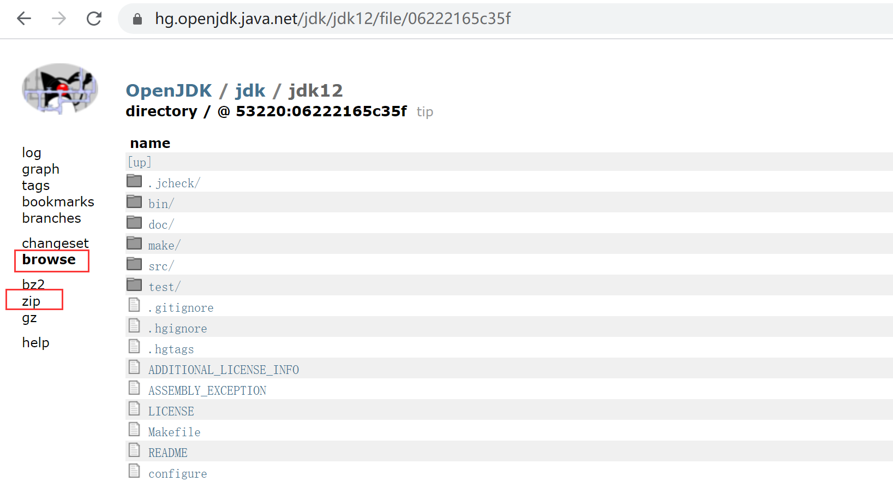
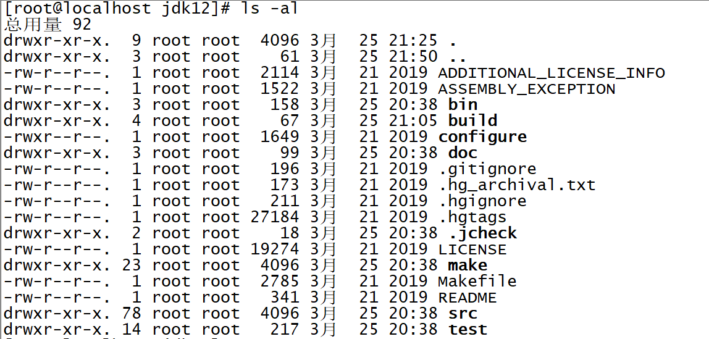

## 环境

虚拟机 Centos7 4核8G

Clion2019.1


## 下载

源码下载地址：https://hg.openjdk.java.net/jdk/jdk12

打开链接后，点击右侧browse，再点击右侧zip进行下载




## 编译

**1、解压缩源码包**

```bash
yum install -y zip
unzip <filename> -d <dirname>
```


**2、安装编译环境**

> 如果还有缺的环境，make编译的时候会有提示

```bash
yum install -y freetype freetype-devel
yum install -y cups
yum install -y xorg-x11-xauth
yum install -y *alsa*
yum install -y libffi libffi-devel
yum install -y autoconf
yum install -y libXtst-devel libXt-devel libXrender-devel libXrandr-devel libXi-devel
yum install -y cups-devel
yum install -y fontconfig-devel
yum groupinstall -y "Development Tools"
```


**3、安装Boot Java**（编译时也有java文件需要编译）

```bash
yum search java|grep jdk # 下载devel版本的（编译jdk12就需要jdk11+版本）
yum install -y java-11-openjdk-devel.x86_64
```


**4、进入源码根目录**




**5、测试配置**

```bash
./configure --with-version-opt="baB.hyf" --with-version-pre=0 --with-version-build=88
```


**6、编译**

```bash
make images
```

> 遇到的报错查看：**jdk12/doc/building.html#troubleshooting**


**7、编译失败了需要清理临时文件**

```bash
make clean
make dist-clean
```


8、编译成功后会在 **jdk12/build/name/*** 下生成编译后的文件


## 导入IDE

CLion环境配置：https://blog.csdn.net/qq_41649001/article/details/107301079

下载MinGW版本：16.1

IDE导入：

New CMake Project from Sources...，选择jdk12，下一步会自动选择导入的模块，完成即可，会自动生成CMakeLists.txt

Edit Configurations...，创建一个CMake Application，Executable选择编译后的java文件，Program arguments输入：`-version -XX:+TraceBytecodes -XX:StopInterpreterAt=395`（395为jvm的入口断点位置），Before Launch下的build删除，调试时防止编译。


Debug即可。


