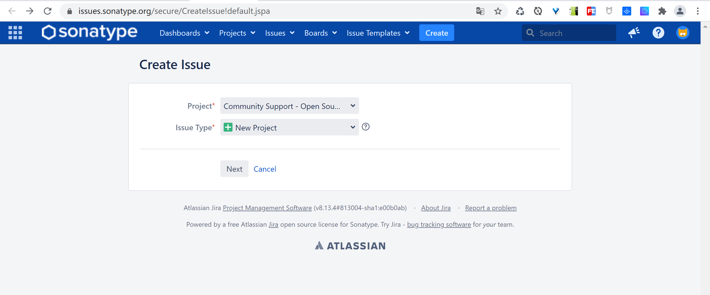
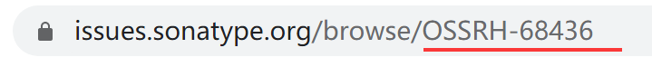
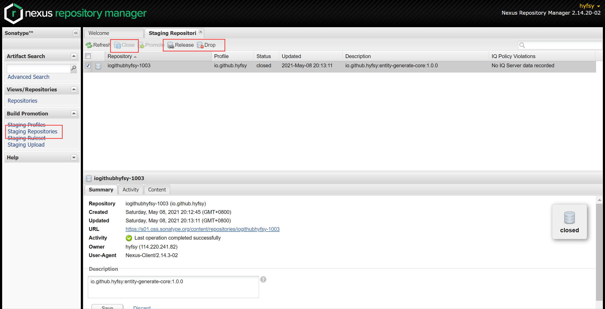

发布流程总体大纲：https://central.sonatype.org/publish/publish-guide


## 1. 名词解释

---

SONATYPE：一个组织机构，管理maven中央仓库

JIRA：问题管理系统（jar上传中央仓库的平台接入口，主要交互的地方）

OSSRH：Sonartype的OSS存储库托管，使用Sonatype Nexus存储库管理器

Sonatype NEXUS：SONATYPE的暂存仓库（最终会同步到中央仓库）


## 2. 步骤

---


> 大致流程如下：
>
> 1、创建Nexus账户及域名验证（仅需一次）
>
> 2、pom添加配置
>
> 3、发布


### 2.1. 注册JIRA账户

https://issues.sonatype.org/secure/Signup!default.jspa


### 2.2. 创建issue

https://issues.sonatype.org/secure/CreateIssue!default.jspa

选择：

- **Community Support - Open Source Project Repository Hosting (OSSRH)**

- **New Project**





Group Id：需要为一个反向的域名，没有自己的域名可以使用`io.github.<username>`，以后需要进行Group Id的验证（主要）

Project URL：GitHub等代码存放的URL地址

SCM URL：Git拉取的地址（HTTP）


创建好后的界面，下方可与工作人员交流（一开始是机器人）


### 2.3. 配置域名验证

认证相关文章：https://central.sonatype.org/publish/requirements/coordinates

自己域名的情况没遇到过，此处不做说明，可自行尝试

如果为GitHub的域名，需要添加一个项目，名称为**ISSUE的名称**



等待sonatype的工作人员审核处理通过。

issue的Status状态变为Resolved状态时，说明可以上传jar包了。


### 2.4. GPG注册

部署的jar包需要验证签名

下载：https://www.gpg4win.org/download.html

安装后验证：

```bash
gpg --version
```

生成秘钥：

```bash
gpg --gen-key
# 输入用户名，为JIRA的用户名
# 输入邮箱，为JIRA的邮箱
# 输入秘钥的密码，自己输入一个，后续需要使用

# 查看所有本地公私钥 或 通过桌面生成的快捷方式查看
gpg --list-keys
```


可看到pub公钥，上传该公钥

```bash
# 要确保 keyserver.ubuntu.com:11371 服务器是可用的

# 上传到服务器
gpg --keyserver hkp://keyserver.ubuntu.com:11371 --send-keys YOUR_PUBLIC_KEY
# 查看是否上传成功，要等待一会儿
gpg --keyserver hkp://keyserver.ubuntu.com:11371 --recv-keys YOUR_PUBLIC_KEY
```


### 2.5. 部署信息修改

添加一些发布必须的内容

maven的**settings.xml**添加

```xml
<?xml version="1.0" encoding="UTF-8"?>
<settings xmlns="http://maven.apache.org/SETTINGS/1.0.0"
          xmlns:xsi="http://www.w3.org/2001/XMLSchema-instance"
          xsi:schemaLocation="http://maven.apache.org/SETTINGS/1.0.0 http://maven.apache.org/xsd/settings-1.0.0.xsd">

	<!-- Nexus服务器地址，和JIRA的用户信息一样 --> 
	<servers>
		<server>
			<id>sonatype-oss</id>
			<username>YOUR_JIRA_USERNAME</username>
			<password>YOUR_JIRA_PASSWORD</password>
		</server>
	</servers>

	<!-- gpg环境，方便上传到Nexus的文件自动Close并Release -->
	<profiles>
		<profile>
			<id>ossrh</id>
    		<!-- 在maven发布的时候无需再输入gpg私钥的密码？好像无效 -->
      		<activation>
        		<activeByDefault>true</activeByDefault>
      		</activation>
			<properties>
				<gpg.executable>gpg</gpg.executable>
				<gpg.passphrase>YOUR_GPG_PASSPHRASE</gpg.passphrase>
			</properties>
		</profile>
	</profiles>
</settings>
```


项目**pom.xml**添加

```xml
<?xml version="1.0" encoding="UTF-8"?>
<project xmlns="http://maven.apache.org/POM/4.0.0" xmlns:xsi="http://www.w3.org/2001/XMLSchema-instance"
         xsi:schemaLocation="http://maven.apache.org/POM/4.0.0 http://maven.apache.org/xsd/maven-4.0.0.xsd">
    <modelVersion>4.0.0</modelVersion>

    <!-- GAV -->
    <groupId>io.github.hyfsy</groupId>
    <artifactId>entity-generate-core</artifactId>
    <version>1.0.0</version>
    <packaging>jar</packaging>

    <properties>
        <project.build.sourceEncoding>UTF-8</project.build.sourceEncoding>
        <maven.compiler.source>1.8</maven.compiler.source>
        <maven.compiler.target>1.8</maven.compiler.target>
        <jdk.version>8</jdk.version>
        <javadoc.skip>false</javadoc.skip>
        <gpg.skip>false</gpg.skip>
        <auto.close.and.release>false</auto.close.and.release>
    </properties>

    <!-- 项目基本信息 -->
    <name>Entity Generate Core</name>
    <url>https://github.com/hyfsy/entity-generate-core</url>
    <description>Convenience to generate entity class</description>

    <!-- 授权 -->
    <licenses>
        <license>
            <name>The Apache License, Version 2.0</name>
            <url>http://www.apache.org/licenses/LICENSE-2.0.txt</url>
            <distribution>repo</distribution>
            <comments>A business-friendly OSS license</comments>
        </license>
    </licenses>

    <!-- SCM地址 -->
    <scm>
        <url>https://github.com/hyfsy/entity-generate-core</url>
        <connection>scm:git:https://github.com/hyfsy/entity-generate-core.git</connection>
        <developerConnection>scm:git:https://github.com/hyfsy/entity-generate-core.git</developerConnection>
    </scm>

    <developers>
        <!-- 个人信息，可选 -->
        <developer>
            <id>hyfsy</id>
            <name>hyfsy</name>
            <email>1577975140@qq.com</email>
            <url>https://github.com/hyfsy</url>
            <roles>
                <role>Developer</role>
            </roles>
            <organization>Hyfsy</organization>
            <organizationUrl>http://hyfsy.github.io</organizationUrl>
            <timezone>+8</timezone>
        </developer>
    </developers>

    <dependencies>
		<!-- ... -->
    </dependencies>

    <profiles>
        <!-- 推荐在Release环境中添加这些插件和仓库，防止开发时打包慢 -->
        <profile>
            <id>release</id>
            <build>
                <plugins>
                    <!-- Compile -->
                    <plugin>
                        <groupId>org.apache.maven.plugins</groupId>
                        <artifactId>maven-compiler-plugin</artifactId>
                        <version>3.8.0</version>
                        <configuration>
                            <encoding>UTF-8</encoding>
                            <source>${jdk.version}</source>
                            <target>${jdk.version}</target>
                        </configuration>
                        <dependencies>
                            <dependency>
                                <groupId>org.codehaus.plexus</groupId>
                                <artifactId>plexus-compiler-javac</artifactId>
                                <version>2.7</version>
                            </dependency>
                        </dependencies>
                    </plugin>
                    <!-- Source 打源码包 -->
                    <plugin>
                        <groupId>org.apache.maven.plugins</groupId>
                        <artifactId>maven-source-plugin</artifactId>
                        <version>3.2.1</version>
                        <executions>
                            <execution>
                                <id>attach-sources</id>
                                <phase>package</phase>
                                <goals>
                                    <goal>jar-no-fork</goal>
                                </goals>
                            </execution>
                        </executions>
                        <configuration>
                            <attach>true</attach>
                        </configuration>
                    </plugin>
                    <!-- JavaDoc 打JavaDoc包 -->
                    <plugin>
                        <groupId>org.apache.maven.plugins</groupId>
                        <artifactId>maven-javadoc-plugin</artifactId>
                        <version>3.2.0</version>
                        <executions>
                            <execution>
                                <id>attach-javadocs</id>
                                <phase>package</phase>
                                <goals>
                                    <goal>jar</goal>
                                </goals>
                            </execution>
                        </executions>
                        <configuration>
                            <!-- 忽略打包报错（文档不符合规范） -->
                            <failOnError>false</failOnError>
                            <doclint>none</doclint>
                            <skip>${javadoc.skip}</skip>
                            <show>public</show>
                            <charset>UTF-8</charset>
                            <encoding>UTF-8</encoding>
                            <docencoding>UTF-8</docencoding>
                            <links>
                                <link>http://docs.oracle.com/javase/6/docs/api</link>
                            </links>
                        </configuration>
                    </plugin>
                    <!-- GPG 验签 -->
                    <plugin>
                        <groupId>org.apache.maven.plugins</groupId>
                        <artifactId>maven-gpg-plugin</artifactId>
                        <version>1.6</version>
                        <executions>
                            <execution>
                                <id>sign-artifacts</id>
                                <!-- 进行验签 -->
                                <phase>verify</phase>
                                <goals>
                                    <goal>sign</goal>
                                </goals>
                            </execution>
                        </executions>
                        <configuration>
                            <skip>${gpg.skip}</skip>
                        </configuration>
                    </plugin>
                    <!-- 上传到Nexus中自动Close并Release，无需再进入Nexus操作 -->
                    <!-- 第一次发布不放心，可禁用，手动到服务器上去确认 -->
                    <plugin>
                        <!-- 爆红不管 -->
                        <groupId>org.sonatype.plugins</groupId>
                        <artifactId>nexus-staging-maven-plugin</artifactId>
                        <version>1.6.8</version>
                        <extensions>true</extensions>
                        <configuration>
                            <!-- id要与settings.xml里的server指定的id保持一致 -->
                            <serverId>sonatype-oss</serverId>
                            <nexusUrl>https://s01.oss.sonatype.org/</nexusUrl>
                            <!-- 发布到阶段存储库成功后是否自动Release，进行中央仓库的同步，这里我们默认去网页上手动进行同步 -->
                            <autoReleaseAfterClose>${auto.close.and.release}</autoReleaseAfterClose>
                        </configuration>
                    </plugin>
                </plugins>
            </build>

            <!-- Upload repository 发布的远程仓库 -->
            <distributionManagement>
                <!-- id要与settings.xml里的server指定的id保持一致 -->
                <snapshotRepository>
                    <id>sonatype-oss</id>
                    <url>https://s01.oss.sonatype.org/content/repositories/snapshots/</url>
                </snapshotRepository>
                <repository>
                    <id>sonatype-oss</id>
                    <url>https://s01.oss.sonatype.org/service/local/staging/deploy/maven2/</url>
                </repository>
            </distributionManagement>
        </profile>
    </profiles>
</project>
```


> 也可参考：https://central.sonatype.org/publish/publish-maven


### 2.6. 发布

```bash
mvn clean deploy -P release # 指定了release环境
```

> 如果没有配置 **nexus-staging-maven-plugin**，在verify阶段还会需要输入上面的 **passphrase** 秘钥密码


### 2.7. 查看

进入SonaType Nexus仓库查看：https://s01.oss.sonatype.org

> 用户名、密码为JIRA的用户名和密码



点击Staging Repositories（阶段存储库），查看所有部署的jar信息，点击Close会开始进行artifact（人工制品）的相关校验，失败会有提示信息，校验成功后点击Release会进行仓库的发布。

> 需要特别注意：相同版本的制品只能Release一次，重复Release会发布失败，所以在Release前请仔细检查Content下将要发布的制品是否存在问题。

Release成功以后，会发布到[OSSRH的版本库](https://repo1.maven.org/maven2)中（10分钟），随后同步到[MAVEN中央仓库](https://search.maven.org)（2小时），[老仓库](https://mvnrepository.com)同步所需的时间会更久一点。

> ~~第一次发布成功后，需要通知工作人员激活中央仓库的同步~~


