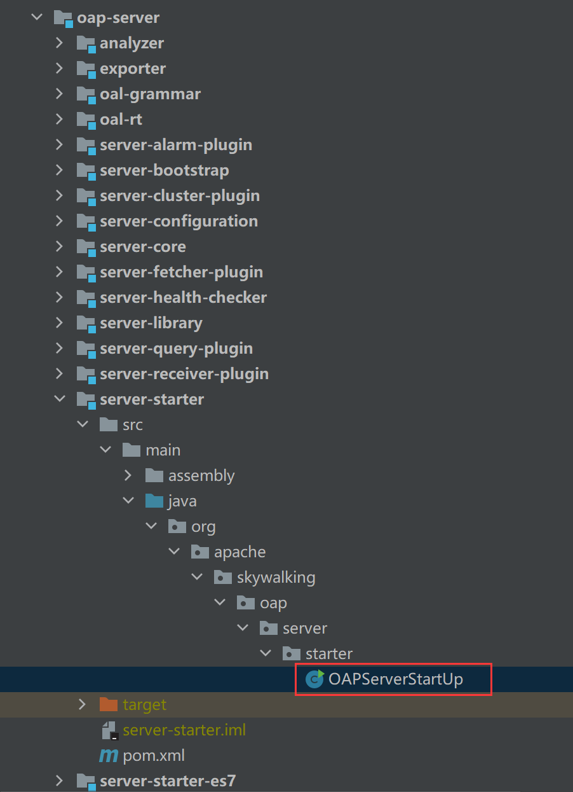
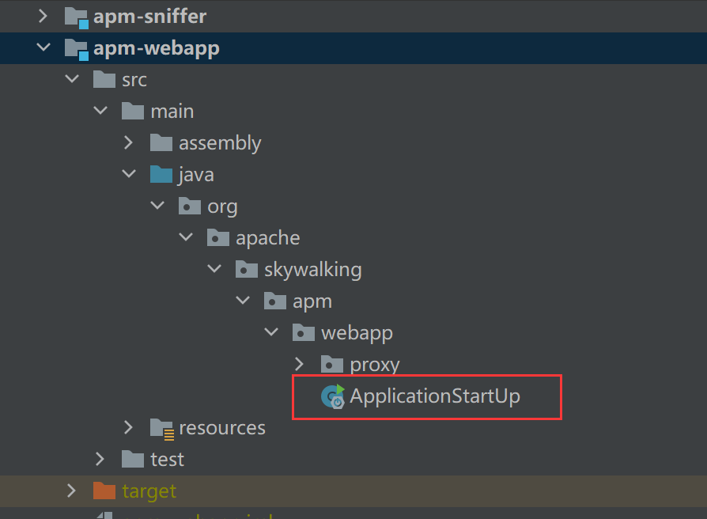
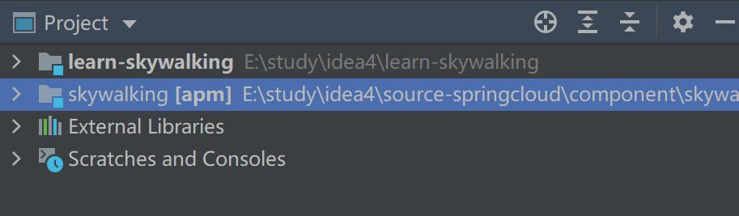
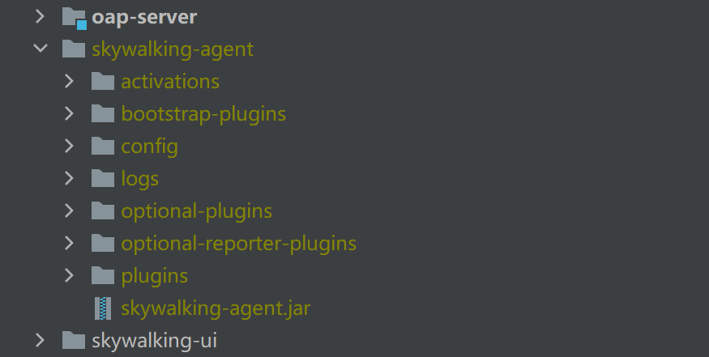
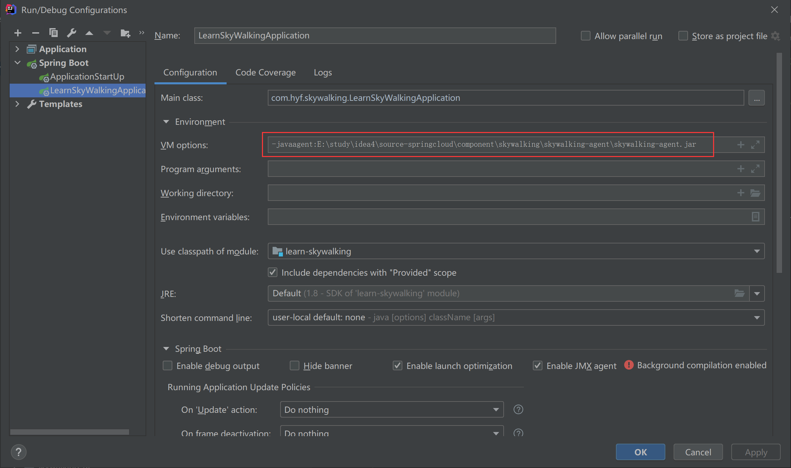
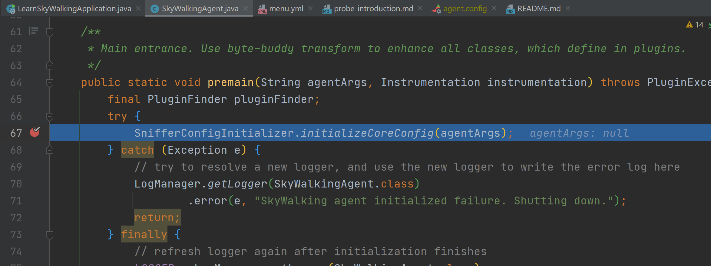
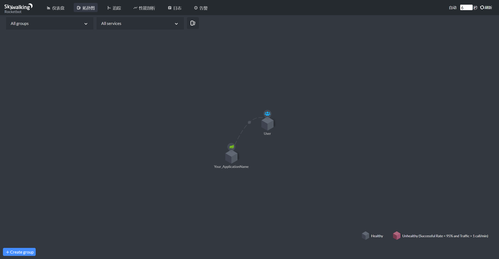

## 本地编译

1、拉取源码并编译：

```bash
git clone https://github.com/apache/skywalking.git
cd skywalking/
git submodule init
git submodule update # 拉取ui项目为子模块
"\path\to\3.6+maven\bin\mvn" install -Dmaven.test.skip=true # 打包
```

> install过程可能会依赖报错，无视，多次install即可（报错不会停止）


2、导入IDE中


3、启动OAP服务




4、运行webapp




5、运行本地客户端

skywalking工程内导入自己的项目




6、确保编译后的 **skywalking-agent** 文件夹存在（客户端代理配置）




7、指定自己项目的代理配置




8、启动自己的项目即可

可以看到进入了断点：




访问Webapp：http://localhost:8080




