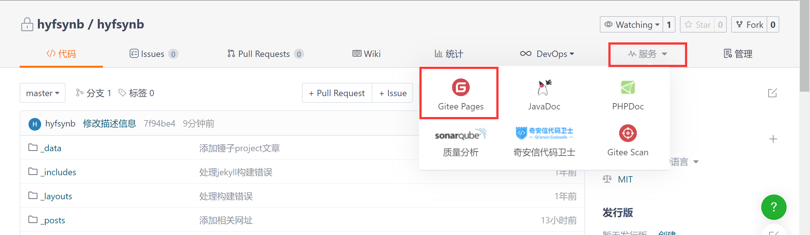

# 仓库准备

---

本文使用已有的 GitHub Pages 仓库工程作为演示。

目标要求：修改一份源代码，同时更新两个仓库代码


已有的GitHub工程目录下执行命令：

```shell
git remote set-url --add origin <gitee-url>
```

之后通过以下名称同时更新

```shell
git push origin master
```


需要先保证两个仓库都一致，包括git版本等内容

操作方式：

```shell
git remote remove origin
git remote add origin <gitee-url>
git push origin master
git remote remove origin
git remote add origin <github-url> # github url放在首位，防止github推送失败，gitee推送成功的情况（网络问题）
```


# 添加Gitee Pages服务

---

gitee上创建任意名称的项目，如果名称为`test`，则通过`http://hyfsynb.gitee.io/test`访问，如果项目名和用户名一致，比如此处名称为`hyfsynb`，则可以直接通过`http://hyfsynb.gitee.io`访问。

选择 **Gitee Pages** 服务：




> 如果没有实名制过，需要先进性下实名制认证的
>
> 如果没有绑定手机号，需要先进行绑定


进入服务后：

**部署分支**选择对应的分支

**部署目录**默认，即整个工程

点击启动按钮，启动服务，之后可通过更新按钮来更新系统或停止按钮停止系统。


