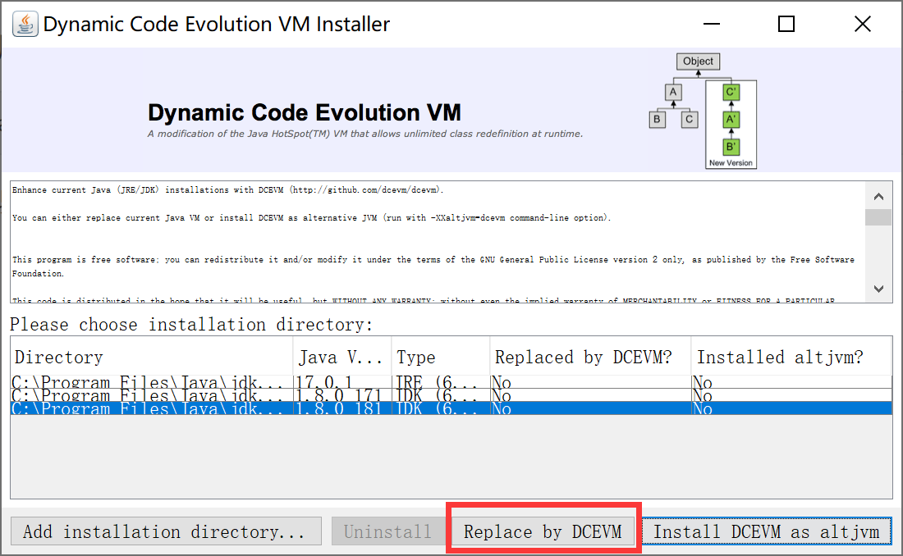
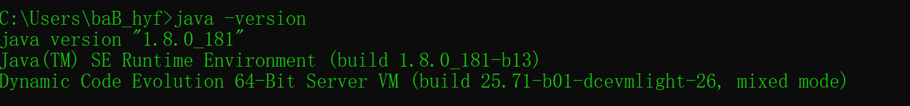

# windows

使用JVM版本：jdk8u181

下载安装工具：<a href = "../images/2022/04/24/attach/DCEVM-8u181-installer.jar" download = "DCEVM-8u181-installer.jar">DCEVM</a>

[DCEVM](../images/2022/04/24/attach/DCEVM-8u181-installer.jar)

使用其他版本的jdk执行以下命令：

```shell
java -jar xxx/DCEVM-8u181-installer.jar
```

看到如下界面：



选择8u181版本的jdk后，点击`Replace by DCEVM`按钮

完成后关闭当前窗口，查看8u181版本的jdk信息

```shell
java -version
```

可以看到最后一行多了`Dynamic Code Evolution`字段，表示安装成功



使用JVMTI工具进行测试即可。


